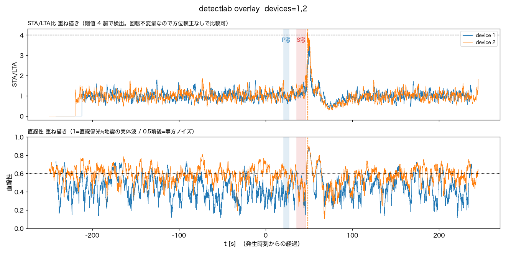

# 2026-08-08 茨城県北部M3.8を、正式イベントでは逃したが事後解析では拾えていた

気象庁の地震情報（第1報 03:41:39発表、2026/08/08 03:41:32発生、震央N36.7/E140.6
茨城県北部、深さ10km、M3.8、震度3）を受けて、本機が拾えていたか確認した。

## 確認したこと

- `/events?all=1` に地震発生後の新規イベントは無し。両機とも直前の最新は
  当日00:19の震度0.7のまま止まっていた → **正式イベントとしては未検知**。
- 観測点（湯沢町）からの震央距離は161km（`detectlab.hypocentral_km`で算出）。
- S3の生波形（`raw/`）を`tools/detectlab.py`で事後解析した。震源緒元は気象庁発表を
  そのまま`--eew "36.7,140.6,10,2026-08-08 03:41:32"`に渡した（tenki.jpの確定URLは
  無かったので`tenki_view.py`は経由せず、`detectlab.py`に直接渡した）。

```bash
python tools/detectlab.py --at "2026-08-08 03:41:32" \
  --eew "36.7,140.6,10,2026-08-08 03:41:32" --minutes 8 --device <1|2> --out ...png
```

## 結果

両機とも、物理的に予測されるS波到達窓（03:42:07-18）の直後というピンポイントな
タイミングで、STA/LTA比と3軸直線性が同時に山を作った。

| | device1 (IIS3DHHC) | device2 (ADXL355) |
|---|---|---|
| STA/LTA peak | 3.59（閾値4未達） | **4.11**（閾値4をわずかに超過） |
| onset位置 | S窓直後 | S窓直後（03:42:19.96〜） |
| 直線性 | ベースライン0.4-0.6 → 山で0.8 | ベースライン0.4-0.6 → 山で0.8-0.9 |
| P/S窓SNR（公式判定） | 0.96-1.14「微妙」 | 0.99-1.23「微妙」 |


振幅ベースのSNRだけを見ると単独では「ノイズと分離できず」の域を出ないが、
直線性（実体波特有の直線偏光の指標。等方ノイズなら0.5前後に留まる）が
2台独立にS波到達予想の瞬間だけ0.8超まで跳ねているのは、偶然の一致としては
説明しにくい。`docs/noise.md`の「検出できた／できなかった」の過去2例
（福島県沖M4.0・熊本地震）と同じ**probable detection**の水準にある。

## 結論

- **リアルタイム検知（速報用途）としては拾えていない**。`firmware`側の
  `kAlertIntensity`閾値に届かず、`device_prompt`イベントは立たなかった。
- **センサ・解析パイプラインの感度としては見えている**。161km・M3.8という
  家庭用地震計には厳しい条件で、2台独立に同じタイミング・同じ物理的特徴
  （直線偏光）を示した。
- 「イベントとして残らなかった」＝「見えていない」ではない、という具体例が
  ひとつ増えた。リアルタイム閾値とオフライン検出限界の間にはまだ差があり、
  その差を埋める（STA/LTAベースの検知をfirmware側に持ち込む等）のは
  今後の検討課題として残る。`docs/noise.md`の「検出できた／できなかった」に
  この事例を追記した。

## 手動イベント化

raw の保持期限(90日)で消える前に、`tools/promote_event.py`で両機とも永久保存した
（onset=03:42:20 JST、保存区間-60s〜+120s）。

- device1: `0001-59537604`（震度0・I=-0.2・peak=0.343gal）
- device2: `0002-59537604`（震度0・I=-0.3・peak=0.294gal）

`manual: true`で記録され、ダッシュボード一覧の既定表示にも出る。

## detectlab.pyに2機重ね描きモードを追加

上の表・図は2枚の画像を見比べる形だったので、「2台一致」をひと目で確認できる
重ね描きモードを`detectlab.py`に足した（`--device 1 2`のように複数指定）。

```bash
python tools/detectlab.py --at "2026-08-08 03:41:32" --device 1 2 \
  --eew "36.7,140.6,10,2026-08-08 03:41:32" --minutes 8 --out overlay.png
```

デバイスごとに個別読み込み・個別解析はそのまま（混ぜて読むと継ぎ目が揺れに見える事故は
避ける）。重ねるのはSTA/LTA比と直線性の2パネルだけにした。生波形やスペクトログラムは
軸の向きが機体ごとに違い重ねる意味が無い一方、STA/LTA・直線性は振幅二乗和・共分散固有値
という**回転不変量**から出るので、方位較正（`docs/device_overlay.md`でまだ未着手）が
無くてもそのまま比較できる。x軸は発生時刻(`--eew`)からの経過秒で揃えるので、
サンプルクロックが独立な2台でも実時刻ベースで並ぶ。



発生時刻+48秒付近で2本の線がきれいに重なって山を作っているのが一目で分かる。
`docs/device_overlay.md`にもこの実装を追記した（§3-cの「震度で比べる」と同じ発想を
診断ビューに先取りで適用したもの、という位置づけ）。
