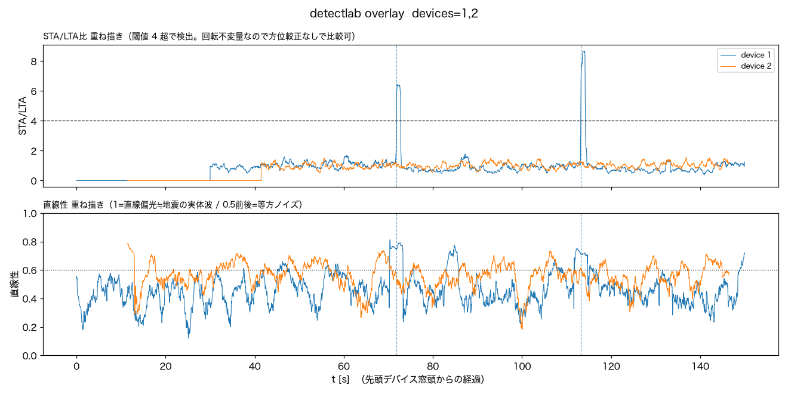
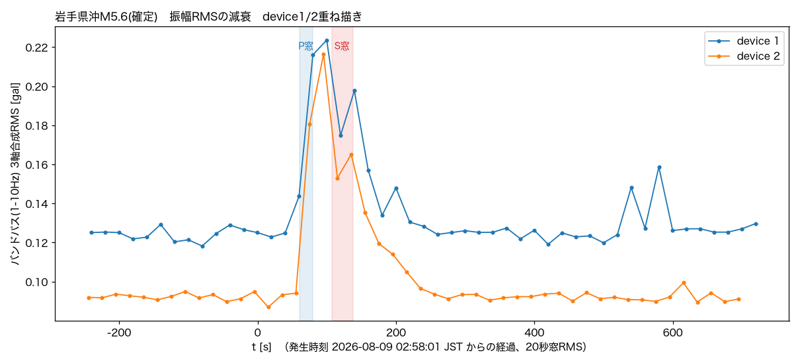

# 2026-08-09 岩手県沖M4.9を、正式イベントでは逃したが事後解析では拾えていた

気象庁の地震情報（第1報 02:58:11発表、2026/08/09 02:58:01発生、震央N40.2/E142.5
岩手県沖、深さ10km、M4.9、震度3）を受けて、本機が拾えていたか確認した。

**確定報では数値が変わっている**（[tenki.jp](https://earthquake.tenki.jp/lite/bousai/earthquake/detail/2026/08/09/2026-08-09-02-58-05.html)
03:02発表: N40.1/E142.4、**深さ約40km**、**M5.6**、**最大震度4**（普代村）。第1報の
震源直後速報は深さ・Mが暫定でよく動く）。震央緯度経度はほぼ同じで、震央距離483kmに
対し深さ10km→40kmでは震源距離が483.1km→484.7kmしか変わらないため、下記のP/S波
到達窓予測・解析結果への影響は無視できる。震源緒元は第1報のまま解析している。

## 確認したこと

- `/events?all=1` に地震発生後の新規イベントは無し。両機とも直前の最新は
  8/8 03:41の茨城県北部イベント(`0001-59537604`/`0002-59537604`)のまま止まっていた
  → **正式イベントとしては未検知**。
- 観測点（湯沢町）からの震央距離は483km（`detectlab.hypocentral_km`で算出）。
  茨城県北部M3.8（161km）より3倍遠いが、M4.9はそれよりマグニチュードが大きい。
- S3の生波形（`raw/`）を`tools/detectlab.py`で事後解析した。震源緒元は気象庁発表を
  そのまま`--eew "40.2,142.5,10,2026-08-09 02:58:01"`に渡した。worktree内には
  terraform stateが無いため`NAMZ_RAW_BUCKET=namazu-data-486414336274`を明示した。

```bash
NAMZ_RAW_BUCKET=namazu-data-486414336274 python tools/detectlab.py \
  --at "2026-08-09 02:58:01" \
  --eew "40.2,142.5,10,2026-08-09 02:58:01" --minutes 8 --device 1 2 --out overlay.png
```

## 結果

両機とも、物理的に予測されるP波到達窓（02:59:02-21）のピンポイントなタイミングで
STA/LTA比が閾値4を同時に超えた。直線性のピークはP窓ではなくその後（S窓付近〜直後、
t+110〜160s）にずれて現れ、これも2台で一致している。

| | device1 (IIS3DHHC) | device2 (ADXL355) |
|---|---|---|
| STA/LTA peak | **4.32**（閾値4超過） | **4.50**（閾値4超過） |
| onset位置 | P窓内 02:59:14.34 | P窓内 02:59:13.27 / 02:59:14.52 |
| P窓 SNR / 直線性 | 1.52 / 0.54「要検討」 | 1.84 / 0.58「要検討」 |
| S窓 SNR / 直線性 | 1.44 / 0.53「要検討」 | 1.66 / 0.57「要検討」 |


振幅ベースのSNR・固定窓での直線性だけを見ると単独では「微妙」の域を出ない
（前回の茨城県北部M3.8ほど直線性が0.8-0.9まで跳ねてはいない）。ただし重ね描き図の
STA/LTAパネルでは、**独立クロックの2台が、幅20秒弱しかない予測P窓の中でほぼ同時刻に
閾値超えのピークを作っている**。483kmという距離でこの一致は偶然とは考えにくい。

さらに、後述（§S窓後も続く減衰波形の確認）の通り**バンドパス振幅そのものを見ると
P窓到達と同時に立ち上がり約160〜180秒かけてなだらかに減衰する、2台に共通する
波形が確認できた**。STA/LTA比は急な変化しか拾わないため単発の山にしか見えないが、
実際には教科書通りの実体波→コーダの減衰形をしている。これは前回の茨城県北部M3.8
（STA/LTAの山のみ）より踏み込んだ根拠で、`docs/noise.md`の「検出できた／できなかった」
の過去3例の中でも最も明瞭な**probable detection**と判断した。

## 結論

- **リアルタイム検知（速報用途）としては拾えていない**。`kAlertIntensity`閾値に届かず、
  `device_prompt`イベントは立たなかった。
- **センサ・解析パイプラインの感度としては見えている**。483km・M4.9という遠地の
  条件で、2台独立にP波到達予想の瞬間にSTA/LTA山が一致した。直線性のピークがP窓より
  後ろ（S窓付近）にずれているのは、P波自体の直線偏光が弱く、後続波（S波・変換波）の
  方が振幅・偏光とも強く出た可能性がある。
- 茨城県北部M3.8（161km）の事例と比べ、距離は3倍でもマグニチュードが大きい分
  STA/LTAの一致という点では同等以上に明瞭だった。「遠い」と「拾えない」は同義ではない、
  という具体例がまた一つ増えた。

## 波形後半に見えた大きな振れの確認

`--minutes 8`の図（device1）の右端付近(t≈440-450s、実時刻03:01:10頃)に約2galの
単発スパイクが写り込んでいたため、表面波の見落としがないか窓を伸ばして確認した。

```bash
python tools/detectlab.py --at "2026-08-09 03:01:30" \
  --eew "40.2,142.5,10,2026-08-09 02:58:01" --minutes 20 --device 1 --out long.png
```

20分窓に伸ばすと、03:07:01・03:07:43にSTA/LTA比6.4・8.7という更に大きな山が
2本見つかった。だがP波到達から9分も後というのは実体波・表面波のどちらの到達時刻
としても説明がつかない。`--device 1 2`の重ね描きで確認すると、**この2本はdevice1
だけに出てdevice2は同時刻ほぼ無反応**（STA/LTA最大1.58、閾値未達）だった。2台の
設置場所は別々なので、地震由来（広域で両機に効くはず）ではなく**device1近傍の
局所的な生活振動**と判断した。

03:01:12頃の約2galスパイクも同様に確認したところ、STA/LTA比自体はほとんど
上がっておらず（バンドパス後も一瞬で終わる単発波形）、STA窓の平滑化に埋もれる
程度に短い＝地震の連続的な揺れとは性質が違う突発ノイズと判断した。

03:07台の2本については、この結論のまま——地震由来ではなくdevice1固有の環境ノイズ。



## S窓後も続く減衰波形の確認（訂正）

上の確認では「device2の図でS窓後(t≈150-450s)も波が続いて見えるのは、単体プロットの
y軸スケールが小さいせいで背景ノイズが目立つだけ」と判断し、`--device 1 2`のSTA/LTA・
直線性の重ね描きがベースラインに戻っていることを根拠にした。**これは誤りだった**。

STA/LTA比は「短期/長期エネルギー比」なので、急な立ち上がりには反応するが、
**なだらかに減衰し続ける信号は長期平均(LTA)自体が追従してしまい、比率が早々に
ベースラインへ戻る**。振幅の変化そのものを見落とす形になっていた。バンドパス後の
3軸合成RMSを20秒窓で直接計算し直したところ、話が違った。

```python
# tools/detectlab.py の load_s3_window()/bandpass() を再利用し、
# 1-10Hzバンドパス後の3軸合成RMSを20秒窓で計算
import sys; sys.path.insert(0, "tools")
from detectlab import load_s3_window, bandpass, resolve_bucket, at_to_us
import numpy as np

end_us = int(at_to_us("2026-08-09 03:02:00") + 8*60*1e6)
data, start_us, fs = load_s3_window(resolve_bucket(None), end_us, 16*60.0, device_id)
vec = np.sqrt((bandpass(data, fs, 1.0, 10.0) ** 2).sum(axis=1))
n = int(20 * fs)
rms = [np.sqrt(np.mean(vec[i:i+n] ** 2)) for i in range(0, len(vec) - n, n)]
```

| t [s] (発生時刻から) | 実時刻 | device1 RMS | device2 RMS |
|---|---|---|---|
| 30 | 02:58:30 | 0.125（平常） | 0.093（平常） |
| 70 | 02:59:10 | 0.216 | 0.181 |
| 90 | 02:59:30 | 0.224（ピーク） | 0.216（ピーク） |
| 130 | 03:00:10 | 0.198 | 0.165 |
| 170 | 03:00:50 | 0.134 | 0.120 |
| 210 | 03:01:30 | 0.131 | 0.105 |
| 230 | 03:01:50 | 0.128（平常に復帰） | 0.097（平常に復帰） |



**P波到達（t≈65-70s）と同時に振幅が平常の約2〜2.5倍へ立ち上がり、約160〜180秒
かけてなだらかに減衰しながら平常値へ戻る**——実体波からコーダへの教科書通りの形が、
device1・device2で時刻・形状ともほぼ一致していた。device1固有の環境ノイズ
（t≈530s・570sの単発スパイク、device2は無反応）とは減衰の仕方が明確に違う
（あちらは瞬間的に立って瞬間的に戻る、こちらは分単位でなだらかに減衰する）。

結論として、この記録で地震由来と言えるのは**P波到達からコーダ減衰まで含む
t≈65-230s（02:59:06〜03:01:50頃）の一連の振れ**であり、STA/LTA山だけを見た当初の
判断より裾野が広い。02:59:13〜14のSTA/LTA山はその立ち上がり直後の急峻な部分を
拾ったに過ぎない。03:07台の2本は引き続きdevice1固有の環境ノイズ（相関なし・
減衰の形も違う）と判断する。

## 手動イベント化

raw の保持期限(90日)で消える前に、`tools/promote_event.py`で両機とも永久保存した
（onset=02:59:14 JST、保存区間-60s〜+120s）。

コーダ減衰の確認後、+120sではt≈230s(コーダが平常値に戻るあたり)まで届いておらず
尻尾が約35秒切れていたと分かったため、`--post 200`（-60s〜+200s、実時刻03:02:34まで）
で同じonsetのまま再実行した。`event_id`はonset由来の固定値なので同じidに上書きされ、
波形バッチは7→10（device1）・14→19（device2）に増えている。

- device1: `0001-59540398`（震度0・I=-0.1・peak=0.388gal）
- device2: `0002-59540398`（震度0・I=-0.2・peak=0.336gal）

`manual: true`で記録され、ダッシュボード一覧の既定表示にも出る。
