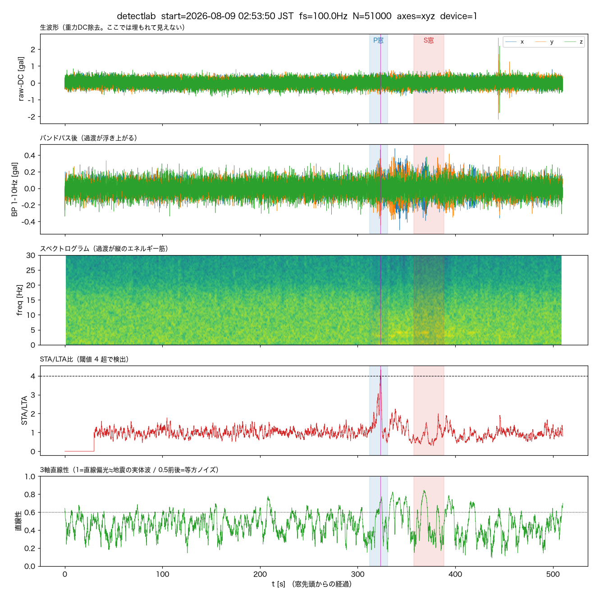
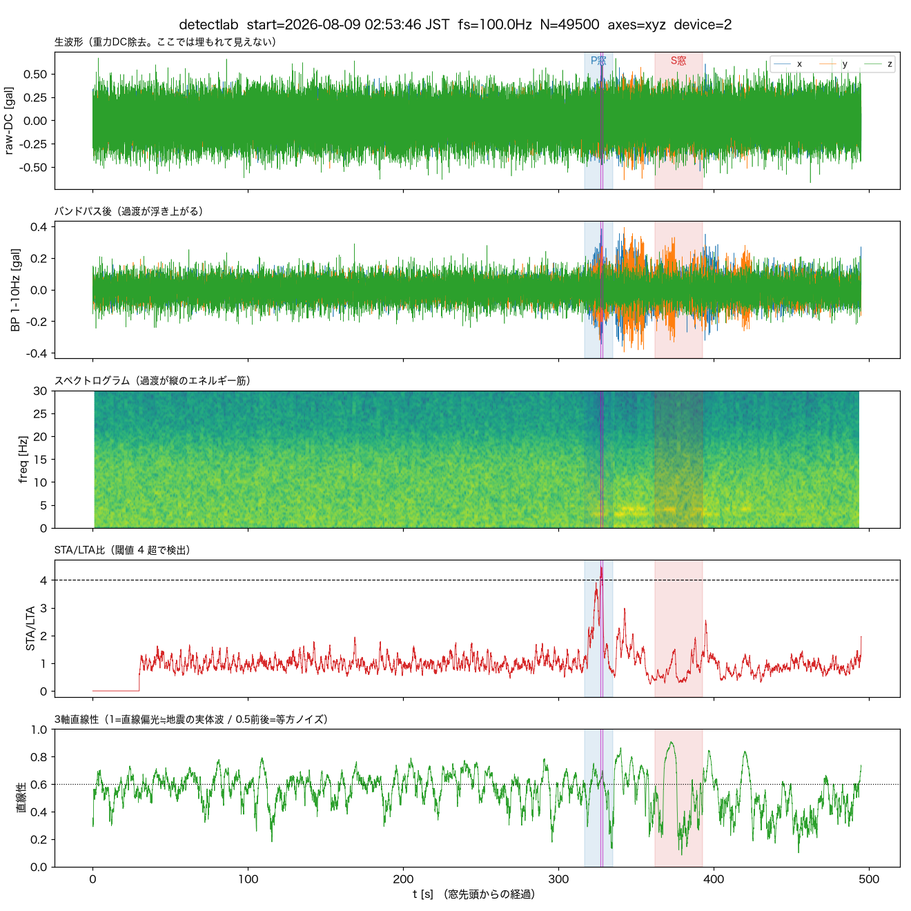
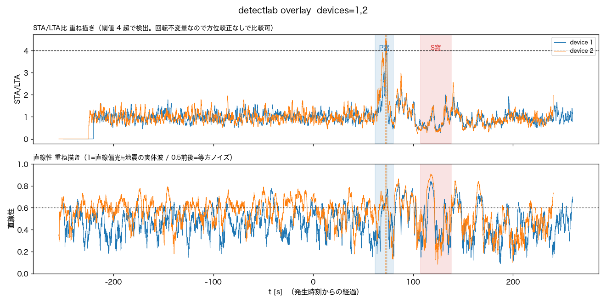

# 2026-08-09 岩手県沖M4.9を、正式イベントでは逃したが事後解析では拾えていた

気象庁の地震情報（第1報 02:58:11発表、2026/08/09 02:58:01発生、震央N40.2/E142.5
岩手県沖、深さ10km、M4.9、震度3）を受けて、本機が拾えていたか確認した。

## 確認したこと

- `/events?all=1` に地震発生後の新規イベントは無し。両機とも直前の最新は
  8/8 03:41の茨城県北部イベント(`0001-59537604`/`0002-59537604`)のまま止まっていた
  → **正式イベントとしては未検知**。
- 観測点（湯沢町）からの震央距離は483km（`detectlab.hypocentral_km`で算出）。
  茨城県北部M3.8（161km）より3倍遠いが、M4.9はそれよりマグニチュードが大きい。
- S3の生波形（`raw/`）を`tools/detectlab.py`で事後解析した。震源緒元は気象庁発表を
  そのまま`--eew "40.2,142.5,10,2026-08-09 02:58:01"`に渡した。worktree内には
  terraform stateが無いため`NAMZ_RAW_BUCKET=namazu-data-486414336274`を明示した。

```bash
NAMZ_RAW_BUCKET=namazu-data-486414336274 python tools/detectlab.py \
  --at "2026-08-09 02:58:01" \
  --eew "40.2,142.5,10,2026-08-09 02:58:01" --minutes 8 --device 1 2 --out overlay.png
```

## 結果

両機とも、物理的に予測されるP波到達窓（02:59:02-21）のピンポイントなタイミングで
STA/LTA比が閾値4を同時に超えた。直線性のピークはP窓ではなくその後（S窓付近〜直後、
t+110〜160s）にずれて現れ、これも2台で一致している。

| | device1 (IIS3DHHC) | device2 (ADXL355) |
|---|---|---|
| STA/LTA peak | **4.32**（閾値4超過） | **4.50**（閾値4超過） |
| onset位置 | P窓内 02:59:14.34 | P窓内 02:59:13.27 / 02:59:14.52 |
| P窓 SNR / 直線性 | 1.52 / 0.54「要検討」 | 1.84 / 0.58「要検討」 |
| S窓 SNR / 直線性 | 1.44 / 0.53「要検討」 | 1.66 / 0.57「要検討」 |





振幅ベースのSNR・固定窓での直線性だけを見ると単独では「微妙」の域を出ない
（前回の茨城県北部M3.8ほど直線性が0.8-0.9まで跳ねてはいない）。ただし重ね描き図の
STA/LTAパネルでは、**独立クロックの2台が、幅20秒弱しかない予測P窓の中でほぼ同時刻に
閾値超えのピークを作っている**。483kmという距離でこの一致は偶然とは考えにくい。
`docs/noise.md`の「検出できた／できなかった」の過去3例と同水準の**probable detection**
と判断した。

## 結論

- **リアルタイム検知（速報用途）としては拾えていない**。`kAlertIntensity`閾値に届かず、
  `device_prompt`イベントは立たなかった。
- **センサ・解析パイプラインの感度としては見えている**。483km・M4.9という遠地の
  条件で、2台独立にP波到達予想の瞬間にSTA/LTA山が一致した。直線性のピークがP窓より
  後ろ（S窓付近）にずれているのは、P波自体の直線偏光が弱く、後続波（S波・変換波）の
  方が振幅・偏光とも強く出た可能性がある。
- 茨城県北部M3.8（161km）の事例と比べ、距離は3倍でもマグニチュードが大きい分
  STA/LTAの一致という点では同等以上に明瞭だった。「遠い」と「拾えない」は同義ではない、
  という具体例がまた一つ増えた。

## 波形後半に見えた大きな振れの確認

`--minutes 8`の図（device1）の右端付近(t≈440-450s、実時刻03:01:10頃)に約2galの
単発スパイクが写り込んでいたため、表面波の見落としがないか窓を伸ばして確認した。

```bash
python tools/detectlab.py --at "2026-08-09 03:01:30" \
  --eew "40.2,142.5,10,2026-08-09 02:58:01" --minutes 20 --device 1 --out long.png
```

20分窓に伸ばすと、03:07:01・03:07:43にSTA/LTA比6.4・8.7という更に大きな山が
2本見つかった。だがP波到達から9分も後というのは実体波・表面波のどちらの到達時刻
としても説明がつかない。`--device 1 2`の重ね描きで確認すると、**この2本はdevice1
だけに出てdevice2は同時刻ほぼ無反応**（STA/LTA最大1.58、閾値未達）だった。2台の
設置場所は別々なので、地震由来（広域で両機に効くはず）ではなく**device1近傍の
局所的な生活振動**と判断した。

03:01:12頃の約2galスパイクも同様に確認したところ、STA/LTA比自体はほとんど
上がっておらず（バンドパス後も一瞬で終わる単発波形）、STA窓の平滑化に埋もれる
程度に短い＝地震の連続的な揺れとは性質が違う突発ノイズと判断した。

結論として、この記録の中で地震由来と言えそうなのは02:59:13〜14（P波窓内）の
STA/LTA山だけで、それ以降の目立つ振れはdevice1固有の環境ノイズだった。

## 手動イベント化

raw の保持期限(90日)で消える前に、`tools/promote_event.py`で両機とも永久保存した
（onset=02:59:14 JST、保存区間-60s〜+120s）。

- device1: `0001-59540398`（震度0・I=-0.1・peak=0.388gal）
- device2: `0002-59540398`（震度0・I=-0.2・peak=0.336gal）

`manual: true`で記録され、ダッシュボード一覧の既定表示にも出る。
