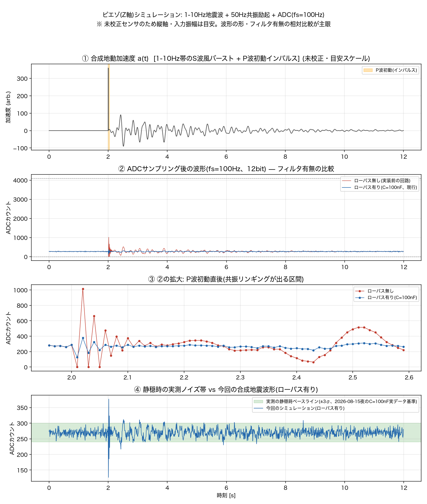
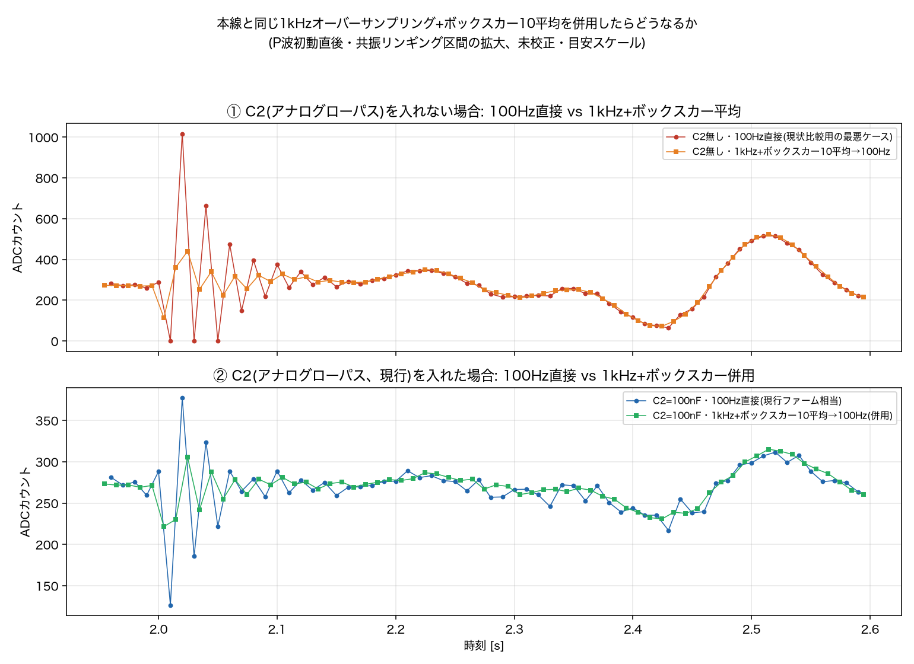

# シミュレーションで地震動の見え方を確認、本線と同じオーバーサンプリング+ボックスカー併用を検討した

「狙ってる周波数帯(1-10Hz)で地震が来たらどんなグラフになるか」という疑問を受け、
Z軸の回路(保護回路+アンチエイリアシングローパス)+機械共振+ADCサンプリングを
通した簡易シミュレーションを組んだ(`tools/piezo_lowpass_sim.py`)。

## シミュレーションの方法

`tools/piezo_lowpass_sim.py`参照。構成:

1. **機械系**: 固有周波数f0=49.947Hz(§5実測)・減衰比ζ=0.1(「3〜4周期で減衰」の
   目視観察から逆算)の標準的な地震計の運動方程式`z'' + 2ζω0 z' + ω0²z = -a(t)`を
   状態空間で解き、地動加速度a(t)から片持ち梁の相対変位z(t)を得る
2. **電気系**: Rb=10MΩ・C1=20nF(仮定)・Rs=47kΩ・C2=100nF(現行実装値)の
   ノード方程式をそのまま状態空間で解く(手計算の近似式ではなく回路そのもの)。
   ピエゾの電流源はI_in=κ・dz/dt(κは未校正の目安定数)とした
3. **入力波形**: 2.3/3.7/5.1/7.2Hzの正弦波を合成し、立ち上がり急峻・減衰は緩やかな
   包絡線で変調したS波風バースト。加えて立ち上がり直後に10ms幅の鋭いインパルスを
   足し、実際の地震のP波初動が構造物の高次共振を叩き起こす様子を模擬した
4. **ADC**: fs=100Hz・12bit量子化で正直にサンプリングし、実測の静穏時ノイズ
   (stdev≈10、2026-08-15夜のC=100nF実データ基準)を重畳

未校正センサのため入力振幅・ピエゾ感度は目安のスケール定数で調整しただけで、
絶対値に意味は無い。信頼していいのは波形の「形」と「フィルタ・オーバーサンプリング
有無の相対比較」。

## 結果1: フィルタ有無の比較

②③で、ローパス無し(赤)は共振が叩き起こされた瞬間、fs=100Hzがちょうど
ナイキストに当たるせいで**サンプル毎に0付近⇄1000近くへジグザグに飛ぶ**——
エイリアシングそのものの見た目になる。ローパス有り(青)はこの暴れがかなり
抑えられている。④で実測の静穏時ノイズ帯(±3σ)と重ねると、初動の瞬間ははっきり
帯の外に飛び出すが、その後の減衰振動(コーダ)部分は帯からわずかにはみ出す程度——
「初動レベルの揺れなら静穏帯からは浮き上がりそう」という一次近似の目安になった。

## 結果2: 本線と同じ1kHzオーバーサンプリング+ボックスカー10平均を併用したら

`docs/design.md`にある本線(IIS3DHHC機)の`kOversample=10`(1kHzで読み10サンプル
平均して100Hzに間引く)をピエゾ側にも適用したらどうなるかを追加でシミュレートした。

P波初動直後(2.0〜2.6秒)の統計:

| 構成 | ピーク | RMS |
|---|---|---|
| C2無し・100Hz直接(最悪ケース) | 746.4 | 163.58 |
| C2無し・1kHz+ボックスカー10平均→100Hz | 253.3 | 103.45 |
| C2=100nF・100Hz直接(現行ファーム相当) | 143.5 | 33.11 |
| **C2=100nF・1kHz+ボックスカー10平均→100Hz(併用)** | **48.5** | **20.62** |

グラフを見ると、改善は**ほぼ立ち上がり(2.0〜2.06秒)の1点に集中している**——
それ以外の区間ではボックスカー有無の2本がほぼ完全に重なる。これは
`docs/log/2026-08-12-piezo-resonance-noise-diagnosis-and-mitigation-plan.md`の
既存の結論(「ボックスカーは連続的な50〜60Hzのトーンには51〜64%しか効かない」)
と矛盾しない——**今回の改善は連続トーンへの周波数選択性ではなく、インパルス性の
強い立ち上がりで生じる「サンプル毎にランダムに0⇄1000へ飛ぶエイリアシングの
暴れそのもの」を、1kHzで正しく標本化してから間引くことで潰しているため**。
ナイキストを超えるのは最終出力レート(100Hz)の方であって、実際にADCを読む
レート(1kHz、ナイキスト500Hz)は共振(50Hz)に対して十分な余裕がある——
「ナイキストを超えたまま生でサンプルする」という§9で問題視した元凶を、
まさに本線と同じ設計思想で解消する側の変更になる。

## 【将来検討・未実装】1kHzオーバーサンプリング+ボックスカー10平均の追加

アナログフィルタ(C2)と併用すると、100Hz直接サンプリングのみ(現行)より
ピーク・RMSとも大きく改善する計算になった(ピークで約1/3)。ただし実装前に
確認が要る点がある:

- **ESP32-C3はシングルコアでWiFi/TLSタスクと時間を取り合っている**
  (`docs/piezo.md` §7)。本線(main.cpp)はデュアルコアでCore1を測定専任にできるが、
  ピエゾ機で1kHzの`analogRead()`をシングルコアで安定して回せるか(WiFi処理に
  食われてサンプリング間隔が乱れないか)は、机上シミュレーションでは分からない。
  実機で確認が必要
- RAM/CPU負荷は小さいはず(ボックスカーは小さいアキュムレータのみで足り、
  バッファ全体を持つ必要は無い)が、これも実測すること

## 次にやること（未着手）

- [ ] 実機で1kHzサンプリング+ボックスカー10平均を試作し、シングルコア+WiFi環境で
      タイミングが安定するか確認する
- [ ] 安定するなら`piezo_main.cpp`に実装し、実データで今回のシミュレーションと
      同程度の改善が出るか確認する
- [ ] C1の実測値が得られたら、`tools/piezo_lowpass_sim.py`のkappa/scale-gal含め
      シミュレーションの前提を検算し直す
