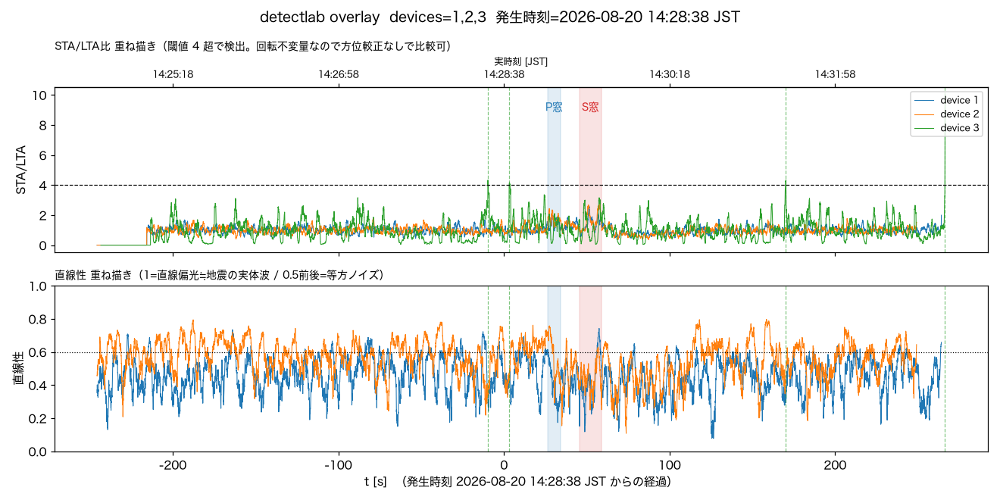
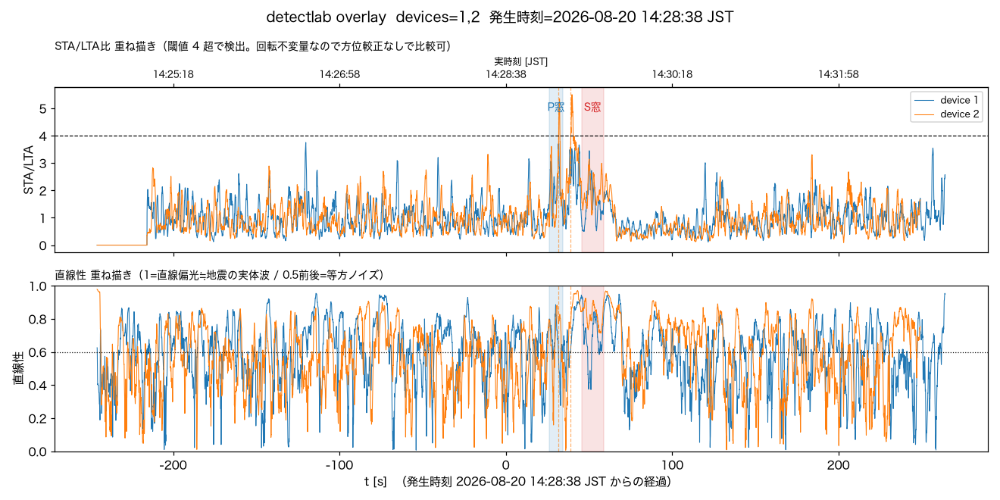

# 2026-08-20 茨城県沖M3.5を、正式イベントでは逃したが事後解析では境界線上に見えた

気象庁の地震情報（第1報 14:28:49発表、2026/08/20 14:28:38発生、震央N36.4/E141.0
茨城県沖、深さ30km、M3.5、震度2）を受けて、本機が拾えていたか確認した。

## 確認したこと

- `/events?all=1` に地震発生後の新規イベントは無し（最新は2026-08-12）。3機とも
  online・正常送信中 → **正式イベントとしては未検知**。
- 観測点からの震央距離は203km（`detectlab.hypocentral_km`で算出、震源距離206km）。
  過去の`probable detection`例（[2026-08-08茨城県北部M3.8](2026-08-08-ibaraki-m3.8-post-hoc-detection.md)、
  161km）より遠く、規模も小さい。
- `tools/detectlab.py`で事後解析。震源緒元は気象庁発表をそのまま
  `--eew "36.4,141.0,30,2026-08-20 14:28:38"`に渡した。

```bash
python tools/detectlab.py --at "2026-08-20 14:28:38" \
  --eew "36.4,141.0,30,2026-08-20 14:28:38" --minutes 8 --device 1 2 3 --out ...png
python tools/detectlab.py --at "2026-08-20 14:28:38" \
  --eew "36.4,141.0,30,2026-08-20 14:28:38" --minutes 8 --device 1 2 \
  --axes xy --band 0.5 2 --out ...png
```

最初は共有チェックアウト（`/Users/nana/codes/NamazuHaUrokoGaNai`、非worktree）の`.venv`で試したが、
`from batch_uplink import s3util`が`ImportError`になった。**共有チェックアウトのgit HEADが
`c95c53e`（PR #113、2026-08-19）より17件も前の`74e2020`（PR #96）に取り残されており、
`s3util`を`batch_uplink`パッケージから`lambda/common/s3util.py`へ引き上げた
2026-08-17のコミット（[log/2026-08-17-pull-in-s3util.md](2026-08-17-pull-in-s3util.md)）を
含んでいなかった**のが原因（`.venv`が古かったのではない）。結果の再現性を担保するため、
このログの解析はworktree（`c95c53e`ベース、`.venv`を作り直し`batch-uplink@v3.0.0`を
インストール）で走らせ直し、共有チェックアウト側の数値と完全一致することを確認した上で
採用している。共有チェックアウトが遅れている件はユーザーに別途報告する。

## 結果

### 3軸・1-10Hz（既定設定）

| | device1 (IIS3DHHC) | device2 (ADXL355) | device3 (ピエゾ) |
|---|---|---|---|
| STA/LTA peak | 2.57（閾値4未達） | 2.79（閾値4未達） | 10.02（だが直線性nan） |
| P窓SNR/直線性 | 1.18 / 0.39 → 微妙 | 1.41 / 0.56 → 要検討 | 0.99 / nan → 微妙 |
| S窓SNR/直線性 | 1.48 / 0.45 → 要検討 | 1.79 / 0.47 → 要検討 | 1.06 / nan → 微妙 |

device3は生RMSが9.2gal（device1/2の1.7-1.4galと桁違い）でノイズフロアがそもそも高く、
軸数不足（ピエゾは1軸）で直線性が計算不能（nan）。STA/LTAの見かけ上の高さはこの
ノイズフロアの荒さを拾っているだけで、地震到達窓の前後にも同程度以上の山が頻発しており
参考にならない（[docs/piezo.md](../piezo.md)、実験機であり定量評価の対象外）。



### 水平2軸・0.5-2Hz（`docs/noise.md`「実務結論」の遠地弱震向け設定）

| | device1 (IIS3DHHC) | device2 (ADXL355) |
|---|---|---|
| STA/LTA peak | 3.75（閾値4に迫るが未達） | **5.50**（閾値4超過、onset候補2件） |
| P窓SNR/直線性 | 1.39 / 0.64 → 要検討 | 1.60 / 0.72 → 地震らしい |
| S窓SNR/直線性 | 2.11 / 0.63 → 地震らしい | 3.28 / 0.80 → 地震らしい |



こちらは2機ともP窓〜S窓の間でSTA/LTAが同時に山を作り、device2は閾値を超えた。
ただし過去の`probable detection`例（[08-08茨城県北部M3.8](2026-08-08-ibaraki-m3.8-post-hoc-detection.md)、
[08-09岩手県沖M5.6](2026-08-09-iwateoki-m4.9-post-hoc-detection.md)）で見えた
「ベースライン0.4-0.6→到達窓だけ0.8-0.9へ跳ねる」明確なコントラストとは違い、
今回は直線性が記録全体（P/S窓の前後含む）を通じて0.8近くまで頻繁に振れており、
到達窓だけが際立って高いわけではない。

## 結論

- **リアルタイム検知（速報用途）としては拾えていない**。従来通り。
- **事後解析でも過去2例（161km M3.8、483km M5.6）ほどの確信は持てない**。標準設定
  （3軸・1-10Hz）では閾値未達かつSNR・直線性ともノイズと分離できず、遠地弱震向け
  設定（水平2軸・0.5-2Hz）では2機ともP窓〜S窓に一致した山を作りdevice2は閾値も
  超えたが、直線性のコントラストが弱く「弱いprobable」止まり。
- 203km・M3.5という条件は、`probable detection`できた161km・M3.8よりも遠くて
  小さい。検出限界のすぐ外側〜境界線上にある事例として、`docs/noise.md`
  「検出できた／できなかった」に追記した。
