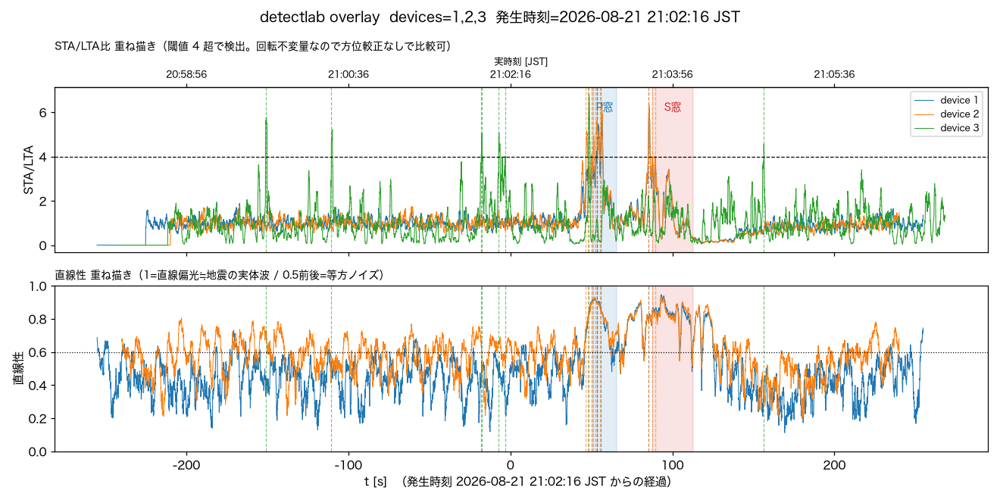

# 2026-08-21 八丈島東方沖M5.5、速報は両機で拾えたがcloud_confirmedは立たず

気象庁発表（21:02:16発生、震央N33.7/E140.5 八丈島東方沖、深さ約60km、M5.5、
最大震度3〈三宅村・御蔵島村〉、都内は震度1-2）を受けて確認した。

## 確認したこと

- `/events?all=1` に該当時刻のイベントが**両機とも**あった:
  `0001-59577127`（device1・I=1.0・peak=0.418gal）、
  `0002-59577127`（device2・I=0.9・peak=0.636gal）。onsetは21:03:48頃
  （発生から約92秒後。震央距離390kmのS波到達として妥当な遅れ）。
- どちらも `device_prompt: true`・`checked: true` だが **`cloud_confirmed: false`**。
  一覧上は「拾えている」ように見えるので、なぜ確定報（Slack通知・events/への昇格）に
  ならなかったか気になったので `lambda/common/detect_core.analyze` を実データに対して
  直接再実行して確認した。

## なぜ cloud_confirmed が立たなかったか

`detect_core.analyze` は「JMA FFTフィルタ後の合成加速度が閾値
(`NAMZ_DETECT_THRESHOLD=0.5`→`amp_for_intensity`で0.603gal)以上を
`HOLD_SECONDS=2.0`秒連続で維持した窓」だけを確定扱いにする（生活振動の単発スパイクを
継続時間で弾くための意図的なガード、`lambda/common/detect_core.py`)。

実データで直接検算すると:

| | device1 | device2 |
|---|---|---|
| 窓全体の計測震度(FFT) | 1.000 | 0.900 |
| 合成加速度ピーク | 1.196 gal | 1.215 gal |
| 閾値(I=0.5=0.603gal)超過の最長連続時間 | **0.40秒** | **0.40秒** |

→ **窓全体の計測震度は速報の値(I=1.0/0.9)と完全に一致**しており、ピークも閾値を
明確に超えている。しかし超過が持続したのは最大0.40秒で、`HOLD_SECONDS=2.0`に届かず
`_first_sustained_run`がNoneを返した。M5.5・深さ60km・390km遠方という条件で
このクラスの揺れが**鋭く短いパルス**だったため、確定報の継続時間ガードにちょうど
引っかかった格好。ガード自体は生活振動除けとして妥当で、変更の必要は感じない
（弱く短い遠地地震はそもそも取りこぼす設計であることの実例が増えただけ）。

## detectlab 事後解析

```bash
python tools/detectlab.py --at "2026-08-21 21:02:16" \
  --eew "33.7,140.5,60,2026-08-21 21:02:16" --minutes 8 --device 1 2 3 \
  --out img/2026-08-21-hachijo-oki-m5.5-3axis.png
```

標準設定（3軸・1-10Hz）だけで両機とも明瞭:

| | device1 (IIS3DHHC) | device2 (ADXL355) | device3 (ピエゾ) |
|---|---|---|---|
| STA/LTA peak | 6.20 | 6.47 | 6.79（直線性nan、参考外） |
| P窓 SNR/直線性 | 2.86 / 0.79 → 地震らしい | 3.81 / 0.80 → 地震らしい | 0.98 / nan → 微妙 |
| S窓 SNR/直線性 | 5.85 / 0.83 → 地震らしい | 7.78 / 0.83 → 地震らしい | 1.03 / nan → 微妙 |

過去の`probable detection`例（茨城県北部M3.8・岩手県沖M5.6等、STA/LTA peak 3.6-4.5）
より明確に閾値を超えており、xy/低帯域設定を追加で回すまでもなく確信できる水準。
device3（ピエゾ）は例によってノイズフロアが高く直線性が計算不能（nan）で判定対象外
（`docs/piezo.md`、実験機）。



## 結論・処理

- 実際の地震であることは速報・事後解析・気象庁発表の三者で一致。`tools/flag_event.py note`
  で両イベントに経緯を記録し、`relate 0001-59577127 0002-59577127`で相互リンクした
  （運用方針は[log/2026-08-20-relate-events-across-devices.md](2026-08-20-relate-events-across-devices.md)）。
  今回は両機とも自動でイベント化済みだったため`promote_event.py`は不要だった。
- 作業に使った共有チェックアウト（`/Users/nana/codes/NamazuHaUrokoGaNai`、非worktree）が
  またoriginから3コミット遅れており（PR #116の`relate`サブコマンドが無い状態）、
  `flag_event.py relate`が`invalid choice`で失敗した。`git pull --ff-only`で追従して
  解決（[2026-08-20の同種の遅れ](2026-08-20-ibaraki-oki-m3.5-post-hoc-detection.md)の再発。
  worktreeでの作業を離れて共有チェックアウトの`.venv`を使う運用が続く限り繰り返しうる）。
