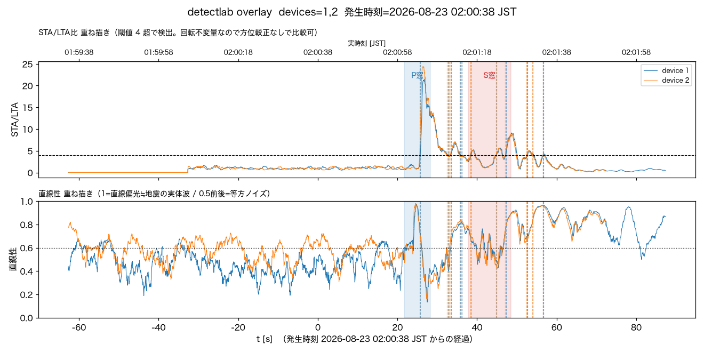
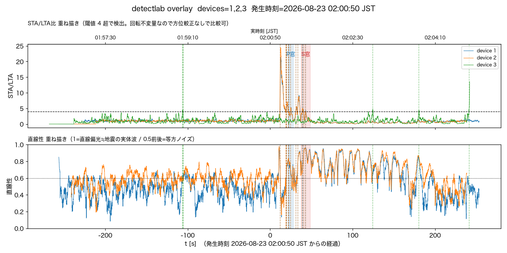
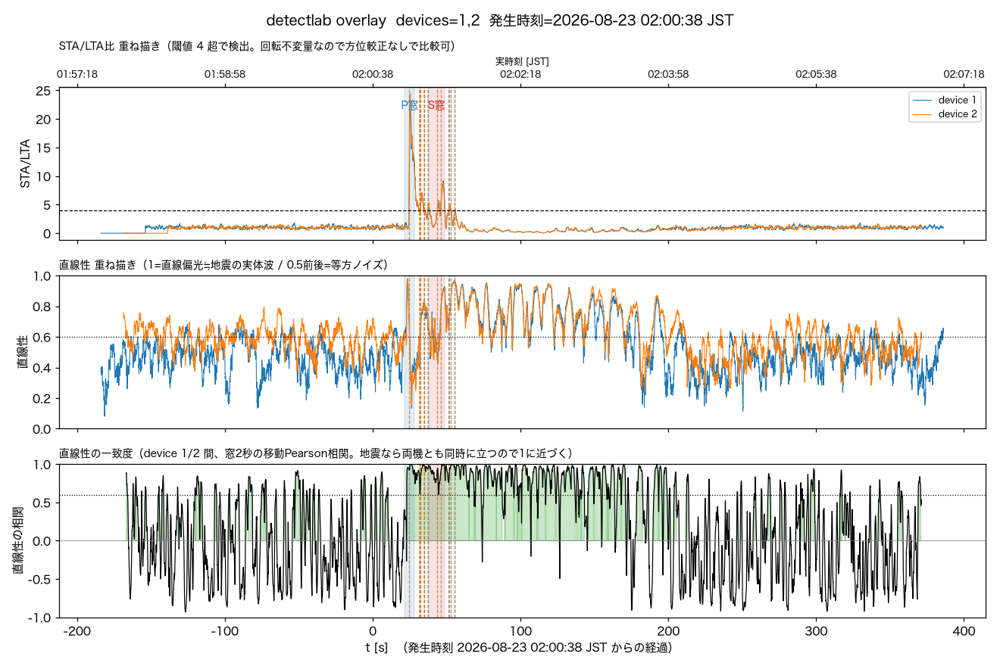

# 2026-08-23 茨城県南部M5.9、速報→クラウド確定まで自動で完走。detectlabで裏取り（発生時刻の秒を誤読し訂正）

気象庁発表（震源N36.0/E140.1・深さ70km・02:00頃発生、M5.9、最大震度5弱〈茨城県北部・
南部/埼玉県南部/千葉県北西部/東京都23区〉）を受けて確認した。

## 自動検知は正常に完走していた

`/events?all=1` に該当イベントがあり、**速報・確定報とも両機で自動発報済み**:

| | device1 | device2 |
|---|---|---|
| event_id | `0001-59580602` | `0002-59580602` |
| onset | 02:01:04.95 | 02:01:04.81 |
| device_prompt / cloud_confirmed | true / **true** | true / **true** |
| max_intensity (confirmed) | 2.7 | 2.6 |
| peak_gal | 8.77 | 8.50 |

八丈島東方沖M5.5（[docs/log/2026-08-21](2026-08-21-hachijo-oki-m5.5-post-hoc-detection.md)）と違い
`HOLD_SECONDS`（現在0.3秒）を越える持続があったため、確定報・Slack通知まで手を加えずに
自動で完走している。今回はイベントとしては「取れている」ことが分かっている状態からの
事後解析依頼だったので、以下は答え合わせ。

## detectlab事後解析（1回目・発生時刻の秒を誤読していた）

```bash
python tools/detectlab.py --at "2026-08-23 02:00:50" \
  --eew "36.0,140.1,70,2026-08-23 02:00:50" --minutes 8 --device 1 2 3 \
  --out docs/log/img/2026-08-23-ibaraki-nanbu-m5.9-3axis.png
```

`--eew`の発生時刻「02:00:50」は、JMAの`EventID`（`20260823020050`）の末尾6桁を
秒だと思い込んで使ったもので、**誤りだった**。実際にJMAの電文本体
（`Body.Earthquake.OriginTime`）を見ると`2026-08-23T02:00:00+09:00`——公式発表の
発生時刻は分単位までしか出ておらず、秒は未公表(0埋め)。EventIDの末尾は最初の電文の
基準時刻に近い内部識別子であって、発生時刻の秒として使ってよい値ではない。

震央距離155km・震源距離170kmとして計算したP窓/S窓は、この誤った秒に基づいていたため
実際の立ち上がりより遅い位置に描かれてしまった（8分窓の重ね描きでは気づけなかったが、
2分窓に絞ったユーザーの指摘で発覚）。1回目の数値（P窓SNR16-22・S窓SNR46-63等）は
前提の発生時刻がズレているため**参考値以上の精度は主張できない**。

## 訂正: 2分窓ズームで見えた本当の立ち上がり、逆算した発生時刻での再確認

2分窓に絞ると、両機ともほぼ同時刻（絶対時刻02:01:03.7〜04頃）に**STA/LTA比≈24・
直線性≈0.95超という、この解析で見た中で最も明瞭で孤立したスパイク**があり、これが
1回目のP窓（02:01:11-18、誤った02:00:50仮定に基づく）より8〜10秒早いと判明した。

P速度6.0-7.8km/s・震源距離170kmで逆算すると、このスパイクが本物のP波初動なら

```
発生時刻 ≒ 02:01:03.75 − (21.8〜28.3秒) ≒ 02:00:35〜02:00:42
```

と推定できる。気象庁の丸め表記「02:00頃」とは矛盾しない。この逆算値（中央値付近の
02:00:38）を仮の発生時刻としてdetectlabを引き直すと、窓は実データとおおむね整合した:

```bash
python tools/detectlab.py --at "2026-08-23 02:00:50" \
  --eew "36.0,140.1,70,2026-08-23 02:00:38" --minutes 2 --device 1 2 \
  --out docs/log/img/2026-08-23-ibaraki-nanbu-m5.9-2min-zoom.png
```

| | device1 | device2 |
|---|---|---|
| P窓(02:00:59-06) SNR/直線性 | 6.91 / 0.39 → 要検討 | 9.31 / 0.37 → 要検討 |
| S窓(02:01:15-26) SNR/直線性 | 27.59 / 0.70 → 地震らしい | 38.12 / 0.71 → 地震らしい |

P窓は**視覚的には**スパイクの立ち上がりをほぼ捉えている（窓が閉じた直後にピークが来る
程度のズレで、STA窓1秒の後方移動平均・実際の波束の継続時間を考えれば許容範囲）。
数値上SNRが低く出るのは、窓内の前半(立ち上がり前の静穏区間)が平均を薄めているという
**指標側の限界**であり、窓の位置自体が大きくズレているわけではない。S窓はSNR27-38と
明瞭に「地震らしい」水準に入った。S窓の後にも同程度以上の山が続くが、震源深さ70km・
M5.9規模の地震ではS波コーダ（後続波）がある程度伸びるのは普通で、S窓は直達S波の
到達部分だけを狙ったものなので、それ自体は窓のズレを意味しない。

以上を踏まえると、**発生時刻を仮に02:00:38前後とした場合、窓と実データの整合性は
悪くない**。ただしこの02:00:38自体が確定値ではなく「1本のスパイクの立ち上がりからの
逆算」に過ぎない点は変わらないため、この節の数値は「地震らしいことの追加傍証」程度に
留め、確定的な精密検証としては扱わない。



device3（ピエゾ）は8分窓の1回目解析時点でP/S窓とも直線性nan・SNR~1.3でノイズと
未分離、イベント自体も生成されていなかった（既知のノイズフロア問題、`docs/piezo.md`
参照。実験機のため判定対象外。この結論は発生時刻の誤りに影響されない）。

参考までに1回目に生成した8分窓の重ね描き（3機分、誤った02:00:50仮定でのP窓/S窓入り）
も残しておく。全体のSTA/LTA挙動を俯瞰する分には有用:



## 副産物: detectlabに直線性の一致度パネルを追加、コーダが3分近く残ると判明

上のズーム画像を見ていて「device2の線が短く途切れている」件を指摘され調べたところ、
バッチ長の非対称（device1=30秒/device2=15秒バッチ、`firmware/src/config.h`）と
`load_window`の「バッチ開始が窓終端以前なら全長を含める」という選び方が組み合わさり、
末尾がバッチ長ぶん短くなる境界効果だと判明した（S3自体は両機とも欠測なく連続していた）。
分析結論には影響しないが、この調査の副産物として`detectlab.py`に2つの改善を入れた
（[tools/detectlab.py](../../tools/detectlab.py)、[tools/README.md](../../tools/README.md)参照）:

1. **2機重ね描きに「直線性の一致度」パネルを追加**（`--corr-win`、既定2秒窓の移動Pearson
   相関）。2機の直線性を共通時間軸に補間して揃え、相関係数を3段目に描く。
2. **`--minutes`の意味を「前後対称」から「`--at`より後ろ」に変更**、前側は新設の
   `--lead-min`（既定3分、`--eew`使用時の背景RMS推定に必要な下限）で別管理にした。
   後ろ(コーダ/後続波)を追いたい時に前まで無駄に伸びていた既存の挙動を直した。

この一致度パネルで発生時刻(02:00:38仮定)から前後6分を見ると、**STA/LTAの山が閾値を
割ってからも、直線性の相関はさらに2分近く高いまま(0.6〜1.0)残り、t+190秒あたりで
ようやく地震前と同じ無相関の乱高下に戻った**。地震前(t<0)の相関は-1〜1を激しく往復し
機体間で無相関だが、地震後はSTA/LTAが収まったt+60秒以降もt+190秒付近まで持続的に
高相関——M5.9・震源距離170kmの規模なら、コーダ波（後続波）が振幅としては閾値未満でも
両機に共通の実体波として数分残っていたと読める。「検知窓(閾値超過)より実際に揺れて
いた時間の方が長い」ことを、振幅に頼らない指標(一致度)で示せた点が収穫。



## 結論・処理

- 速報・確定報・detectlab事後解析（鋭いSTA/LTAスパイク）・気象庁発表が一致し、
  実際の地震であることに疑いはない。ただし「P窓/S窓のSNRが〜」という定量的な
  裏付けは、発生時刻の秒が不明である以上今回は主張しない。
  `tools/flag_event.py note`で両イベントに訂正後の解析結果を記録し、
  `relate 0001-59580602 0002-59580602`で相互リンクした
  （運用方針は[docs/log/2026-08-20](2026-08-20-relate-events-across-devices.md)）。
- **教訓: JMAの`EventID`の末尾桁を発生時刻の秒として使わない。** 発生時刻の秒は
  電文の`OriginTime`フィールドを見ても大抵00埋めで、確定した秒情報は当日中には
  出ないことが多い。今後`--eew`に渡す発生時刻は、公式発表の分単位表記＋
  「秒は不明」として扱い、必要なら実データの孤立したSTA/LTAスパイクから逆算する。
- このレポのworktree（`.venv`が無い）から作業したため、`tools/detectlab.py`の
  rawバケット自動解決（`terraform output`）が失敗した。共有チェックアウト
  （`/Users/nana/codes/NamazuHaUrokoGaNai/terraform`）側で`terraform output -raw data_bucket`
  を引いて`--bucket`に明示指定・`.venv/bin/python3`をフルパスで呼ぶことで回避した。
  worktreeで事後解析系ツールを使う時は毎回このひと手間が要る。
