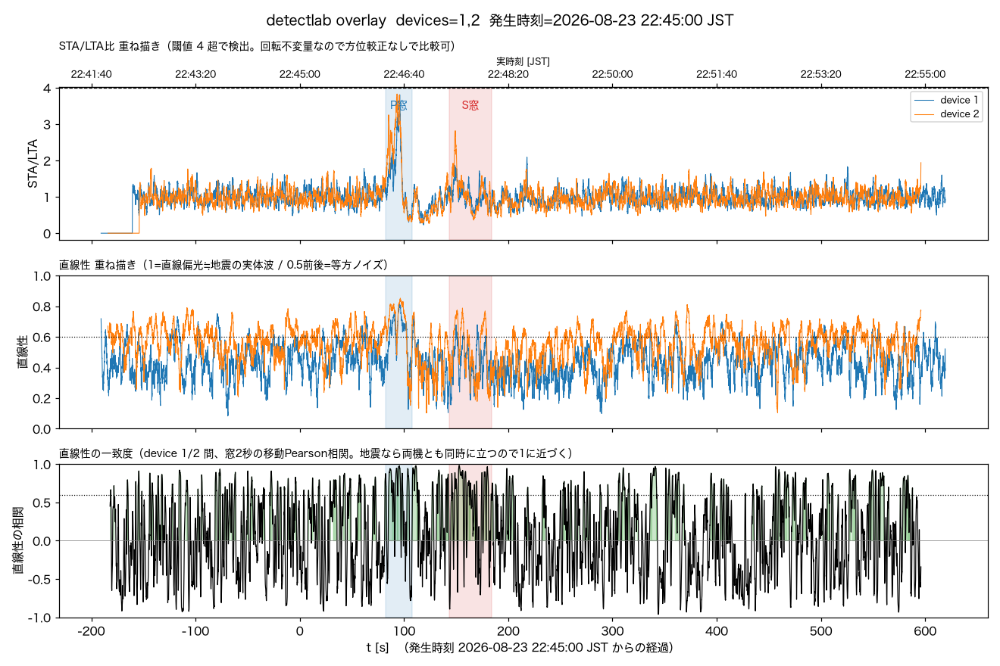
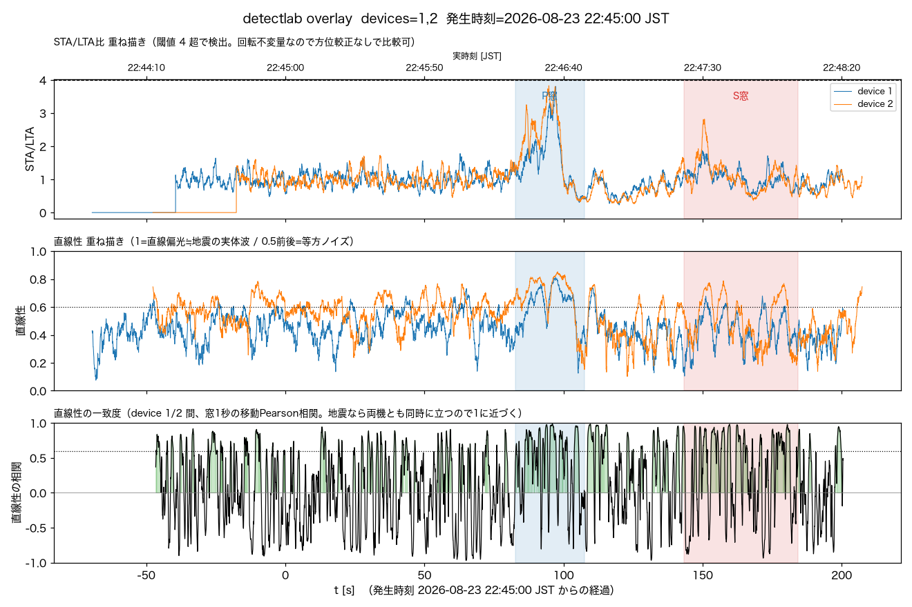
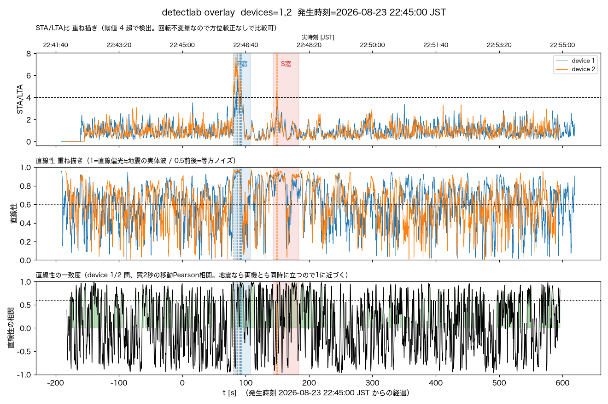

# 2026-08-24 浦河沖M6.0、事後解析。標準設定では僅差で閾値未達、低帯域・水平2軸ではprobable detection。副産物でdetectlabの`--at`回帰バグを踏んで直した

気象庁発表（震源N41.8/E142.9・深さ約40km・2026-08-23 22:45頃発生・気象庁発表22:49、M6.0、
最大震度4〈函館市・浦河町・様似町・えりも町ほか北海道〉、宮城県まで震度1）を受けて確認した。

## リアルタイム自動検知: イベントなし

`/events?all=1`（未評価・人工地震も含む全件）にも該当イベントは無い。DB内の最新イベントは
同日02:01頃の[茨城県南部M5.9](2026-08-23-ibaraki-nanbu-m5.9-post-hoc-detection.md)で止まって
おり、22:45台のイベントは一切生成されていなかった。

観測点（既定=NAMZ_STATION_LATLON未設定時の湯沢町概略座標）からの震央距離644km・震源距離645km。
過去の事後解析対象の中では[令和8年熊本地震](../noise.md)（震源距離~870km、完全埋没）に次いで
2番目に遠い。

## detectlabの回帰バグを踏んで直した

`python tools/detectlab.py --at ... --eew ... --device 1 2 --out ...`を実行したところ、
`TypeError: object of type 'NoneType' has no len()`で即死した。直前のコミット
(`9aa3934` 「detectlabに複数event_idの重ね描き」)より前の`b97892b`で、`--event`未指定
（`--at`系）時に`args.event`が`None`のままになる分岐が

```python
elif args.event:          # b97892b以前
```

から

```python
elif len(args.event) == 1:   # b97892b以降。argsが None だと即死
```

に変わっており、`--at`だけを使う（`--event`を渡さない）呼び出し経路が丸ごと壊れていた。
`elif args.event and len(args.event) == 1:`に修正。既存のユニットテストは`expand_event_ids()`
単体しか見ておらず`main()`のCLI経路を通していなかったため、この回帰は検出されなかった。
再発防止に`--at`単機・`--event`無指定でCLI全体を通す回帰テスト
（`test_main_at_single_device_without_event`、S3呼び出しはmonkeypatchで差し替え）を追加した。

## detectlab事後解析（標準設定: 3軸・1-10Hz）

```bash
python tools/detectlab.py --at "2026-08-23 22:45:00" \
  --eew "41.8,142.9,40,2026-08-23 22:45:00" --minutes 10 --device 1 2 \
  --out docs/log/img/2026-08-23-urakawa-oki-m6.0-8min.png
```

| | device1 | device2 |
|---|---|---|
| STA/LTA peak（全窓中の最大値） | 3.81 | 3.83 |
| 閾値(4)超過 | 未達（僅差） | 未達（僅差） |
| P窓(22:46:22-47) SNR/直線性 | 1.62 / 0.65 → 地震らしい | 2.04 / 0.72 → 地震らしい |
| S窓(22:47:23-48:04) SNR/直線性 | 1.28 / 0.45 → 微妙 | 1.48 / 0.54 → 要検討 |

標準設定ではリアルタイム閾値(4)にわずかに届かず、自動検知が起きなかったのは妥当な結果だった。
ただし**全窓（前後13分）中の最大STA/LTAピーク上位を機械的に抽出すると、両機とも上位のほとんどが
P窓予測時刻(t+82.7〜107.5秒、Vp 6.0-7.8km/s)に密集していた**:

- device1: 上位5ピークのうち4つがt=+85.8〜95.9s（1位3.811@t+95.9s、直線性0.80）
- device2: 上位5ピークのうち3つがt=+85.2〜96.7s（1位3.831@t+93.3s、直線性0.58）、
  4位がt+149.3s（S窓予測 t+143〜184s内）

device1の最高ピーク(22:46:37.71)とdevice2の最高ピーク(22:46:35.38)は2.3秒差で、独立稼働する
2機が偶然この位置に別々のノイズ山を作ったとは考えにくい一致。



2分窓ズームでも同じスパイクが視覚的に確認できる:



## detectlab事後解析（低帯域0.5-2Hz・水平2軸: 熊本地震/茨城県沖M3.5で有効だった設定）

```bash
python tools/detectlab.py --at "2026-08-23 22:45:00" \
  --eew "41.8,142.9,40,2026-08-23 22:45:00" --minutes 10 --device 1 2 \
  --band 0.5 2 --axes xy --out docs/log/img/2026-08-23-urakawa-oki-m6.0-lowband-xy.png
```

| | device1 | device2 |
|---|---|---|
| STA/LTA peak | **5.61（閾値超過）** | **7.67（閾値超過）** |
| onset候補（自動検出） | 22:46:21.2〜33.1（P窓内、直線性0.76-0.94） | 22:46:20.6/30.6（P窓）・22:47:28.7/29.8（S窓）、直線性0.90-0.95 |
| P窓 SNR/直線性 | 3.21 / 0.68 → 地震らしい | 5.02 / 0.76 → 地震らしい |
| S窓 SNR/直線性 | 2.46 / 0.82 → 地震らしい | 3.71 / 0.89 → 地震らしい |

標準設定では閾値未達だった同じ地震が、**低帯域・水平2軸に切り替えると両機とも閾値(4)を明確に
超過し、P窓・S窓それぞれに孤立した鋭いピークを作る**。図を見ても、この設定でのSTA/LTAピークは
前後13分の中で他を大きく引き離す唯一のクラスタで、ノイズとの取り違えは考えにくい。



## 直線性の一致度パネルはなぜ低く見えるか（区間別に定量化）

生成した図はどれも3段目「直線性の一致度」パネルが終始-1〜1を激しく往復しており、茨城県南部
M5.9の図（S窓通過後もSTA/LTAが閾値を割ってから2分近く相関0.6〜1.0が残った）と比べると
一見「あまり一致していない」ように見える。区間別（背景/P窓/S窓/コーダ/裾）に移動相関の平均と
「0.6超の割合」を数値化して確認した:

| 区間 | 標準(1-10Hz,xyz) 平均相関 / frac>0.6 | 低帯域(0.5-2Hz,xy) 平均相関 / frac>0.6 |
|---|---|---|
| background(-180〜-30s) | +0.01 / 15% | +0.07 / 25% |
| **P窓(82-107s)** | **+0.44 / 54%** | **+0.41 / 44%** |
| **S窓(143-184s)** | **+0.37 / 44%** | **+0.25 / 41%** |
| coda(190-400s) | +0.02 / 17% | +0.02 / 19% |
| tail(400-600s) | +0.04 / 19% | +0.05 / 22% |

分かったこと2点:

1. **一致度は「全体的に低い」のではなく「P窓・S窓の間だけ跳ねて、その外はほぼゼロに戻る」形。**
   background(地震前)の平均相関はほぼ0で当然だが、P窓・S窓では平均+0.25〜0.44・frac>0.6が
   40〜54%まで統計的にはっきり跳ね上がっている。「probable detection」の根拠自体はここにある。
2. **M5.9との違いは「跳ねた後、戻るのが速い」こと。** 今回はcoda(190-400s)・tail(400-600s)が
   backgroundとほぼ同水準(frac>0.6が17〜22%)まで即座に戻る。震源距離645km（M5.9は170km）と
   遠く、P窓のSNRも1.6〜5程度（M5.9のS窓はSNR27-38）しかないため、コーダは物理的には存在する
   はずでも、直達波のピークを過ぎた途端にノイズフロアへ埋もれ、両機に共通する実信号が相関を
   支配し続けられなくなる、と理解するのが妥当。

なお背景区間でもfrac>0.6が15-25%あるのは、2秒窓のPearson相関という指標自体がサンプル数の
少なさゆえに本質的にノイジーで、純粋な独立ノイズ同士でもある程度の確率で偶然0.6を超えるという
指標側の性質であり、今回に限った話ではなく過去のログの背景区間でも同じ挙動が出ている。

## 結論

**probable detection**。リアルタイムの標準設定(3軸1-10Hz・閾値4)では僅差(3.81/3.83)で自動
検知に至らなかったが、事後解析で低帯域・水平2軸に切り替えると両機とも閾値を明確に超え、
P波・S波それぞれの予測到達窓に2機一致した鋭いピークが立つ。標準設定でも「全窓中の最大ピークが
P窓に密集する」という弱い傍証は得られており、ノイズとして片付けるより地震由来と見るのが妥当。

震源距離645kmは記録上2番目に遠い事例（熊本地震870kmに次ぐ）で、M6.0規模でも標準設定の
自動検知閾値には届かない距離であること、一方で低帯域・水平2軸なら検知できる境界線がこの
距離帯にあることを示す新しい参考点になった（`docs/noise.md`「検出できた／できなかった」節に
追記）。
