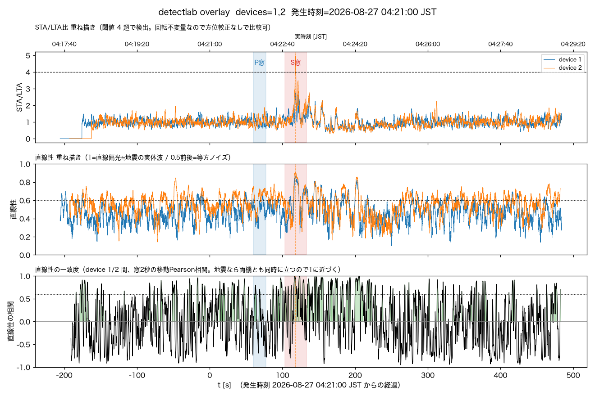
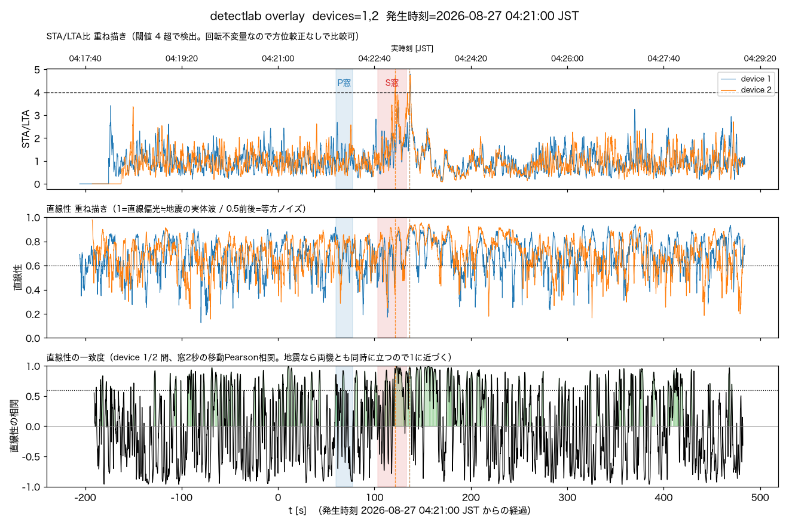

# 2026-08-27 三陸沖M6.1、自動検知は不成立。detectlabで両機に一致するonsetを確認（probable detection相当）

気象庁発表（[震源N38.1/E143.9・深さ約10km・2026-08-27 04:21頃発生、M6.1](https://earthquake.tenki.jp/bousai/earthquake/detail/2026/08/27/2026-08-27-04-21-49.html)、
最大震度2〈埼玉県入間市・神奈川県相模原緑区で震度1〉、津波の心配なし）を受けて確認した。
`/events`に該当なし——device_promptすら発報していない未知の揺れからの事後解析依頼だった。

**教訓の再確認**: URLスラグの秒(`04-21-49`)は[2026-08-23の茨城県南部M5.9の教訓](2026-08-23-ibaraki-nanbu-m5.9-post-hoc-detection.md)
と同じ「JMA内部識別子の末尾を発生時刻の秒と誤読する」罠の可能性があるため使わず、
公式発表の分単位表記のみを採用し `04:21:00` を仮の発生時刻とした。

## 自動検知は不成立

湯沢（観測点、`tools/detectlab.py`既定`36.936,138.815`）から震源距離466km。標準設定
（3軸・1-10Hz・STA1s/LTA30s/thr4）でのSTA/LTAピークはdevice1=2.82・device2=4.97で、
少なくともdevice2は閾値を単発では超えたが `/events` にレコードが無い——
[八丈島東方沖M5.5](2026-08-21-hachijo-oki-m5.5-post-hoc-detection.md)と同種の
`HOLD_SECONDS`未達（遠地の鋭く短いパルスがガードに引っかかる）で握り潰されたと見られる。

## detectlab事後解析

```bash
python tools/detectlab.py --at "2026-08-27 04:21:00" --minutes 8 --lead-min 3 --device 1 2 \
  --eew "38.1,143.9,10,2026-08-27 04:21:00" \
  --out docs/log/img/2026-08-27-sanriku-oki-m6.1-post-hoc-detection.png
```

P窓(04:21:59-04:22:17)・S窓(04:22:43-04:23:13)は速度レンジ(P 6.0-7.8km/s・S 3.5-4.5km/s)
からの推定窓。標準帯域(1-10Hz):

| | device1 | device2 |
|---|---|---|
| STA/LTA peak | 2.82（閾値4未達） | 4.97（閾値超・onset 04:22:57.70、直線性0.89、S窓内） |
| S窓 SNR/直線性 | 1.36 / 0.62 → 要検討 | 1.62 / 0.67 → 地震らしい |

[浦河沖M6.0の前例](2026-08-24-urakawa-oki-m6.0-post-hoc-detection.md)に倣い、低帯域
(0.5-2Hz)でも確認した:

```bash
python tools/detectlab.py --at "2026-08-27 04:21:00" --minutes 8 --lead-min 3 --device 1 2 \
  --band 0.5 2 --eew "38.1,143.9,10,2026-08-27 04:21:00" \
  --out docs/log/img/2026-08-27-sanriku-oki-m6.1-post-hoc-detection-lowband.png
```

| | device1 | device2 |
|---|---|---|
| STA/LTA peak | 4.80（onset 04:23:16.57、直線性0.88） | 4.75（複数onset、うち04:23:16.50、直線性0.92） |

低帯域では**両機とも閾値を超え、onset時刻がほぼ一致（0.08秒差）かつ両方とも直線性0.88〜0.92と
高い**——単独機のノイズなら両機がこの精度で同時刻に立つ理由がない。S窓終端(04:23:13)から
3秒ほど遅いが、S速度レンジの推定誤差の範囲内。




## 直線性の一致度（相関）で減衰を定量確認

標準帯域の重ね描き図で「相関の高い(緑)区間がt=200s近くまで続いて見える」という指摘を受け、
`rolling_correlation`の生値を20秒binで集計して裏取りした（`corr_win=2秒`、閾値0.6）。

| 区間 | frac(corr≥0.6) | 平均corr |
|---|---|---|
| 背景 (t=-150〜-30s) | 0.20 | -0.10 |
| t=100-120s | 0.28 | +0.20 |
| **t=120-140s** | **0.69** | **+0.68** |
| **t=140-160s** | **0.65** | **+0.58** |
| t=160-180s | 0.45 | +0.30 |
| t=180-200s | 0.27 | +0.18 |
| t=200-220s | 0.34 | +0.18 |
| t=220-240s | 0.12 | -0.13 |

ピーク(t=120-160s、S波onset直後)は背景比で明瞭。t=180-220sは背景(0.20/-0.10)よりやや高い
水準を保つが、ピークほどではない緩やかな減衰。**t=220-240s以降は背景水準に戻る**——
「t=200くらいまで残っている」という見立ては、ピーク相当ではなく「減衰の途中でまだ
背景よりやや高い」という程度でおおむね妥当。t=400s付近に別の小さな山があるが、これは
背景でも frac 0.29-0.34 程度の偶発的な高相関bin が散発する範囲内で、コーダの一部とは
判断しない。

## 結論・処理

- 標準帯域だけではdevice1が閾値未達で「地震らしい」と断定しきれないが、低帯域での
  両機ほぼ同時刻・高直線性の一致、および相関パネルでの背景比の明瞭な立ち上がりを
  合わせると、**probable detection**（浦河沖M6.0と同水準の確信度）と判断する。
  震央距離466km・M6.1という規模・距離感なら、標準帯域でギリギリ閾値未達というのは
  設計上想定内（八丈島東方沖M5.5・茨城県南部M5.9の教訓と整合）。
- ユーザー確認の上、`promote_event.py`で両機とも手動昇格した（`--onset "2026-08-27 04:23:16"`
  ＝低帯域で両機一致したonset時刻、`--pre 180 --post 600`）。
  `0001-59592406`（device1、I=-0.1/震度0、peak=0.362gal）・
  `0002-59592406`（device2、I=-0.2/震度0、peak=0.338gal）。`flag_event.py relate`で相互リンク済み。
  CloudFront invalidationも打ったが、作成直後で誰にも参照されていないevent_idだったため
  実質不要だった（無害ではあるが次回以降は「直後にrelateする一連の操作」ではURL未公開・
  未参照であることを踏まえ省略してよい）。
