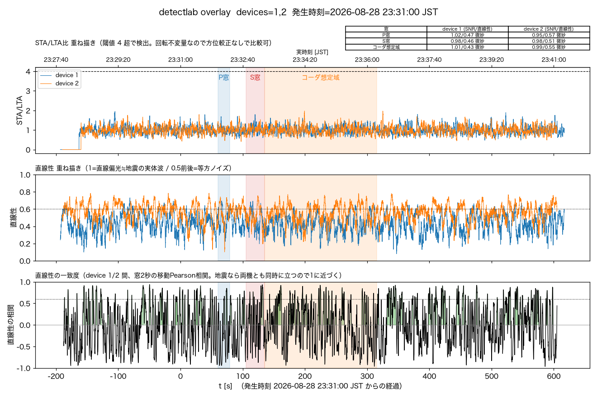
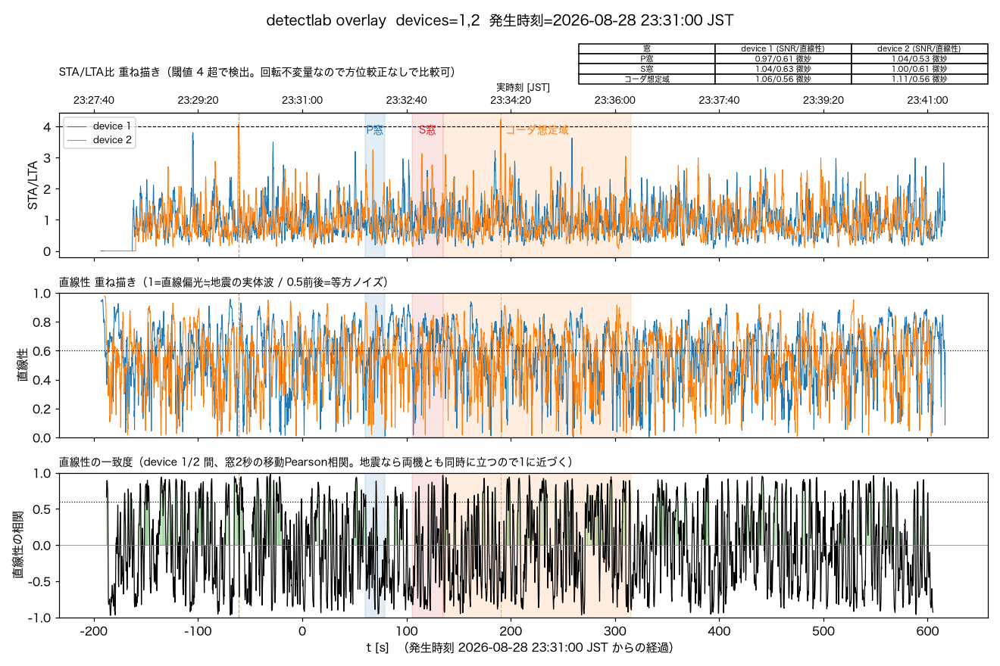

# 2026-08-28 岩手県沖M4.3 事後解析

## 震源要素

気象庁「震源・震度情報」より:

- 震央: 岩手県沖 N40.2/E142.3、深さ40km
- マグニチュード: M4.3
- 発生時刻: 2026-08-28 23:31頃（気象庁発表 23:34）
- 最大震度: 2（岩手県沿岸北部・宮城県北部）

震源要素は`https://www.jma.go.jp/bosai/quake/data/list.json`から直接取得した（先頭要素が
最新地震）。tenki.jpの詳細ページやユーザー貼り付けの電文が無くても、この一覧から
「直近の地震が何か」自体を特定できる。この取得経路自体は
[docs/post_hoc_detection.md](../post_hoc_detection.md)の手順0に明記されておらず
（`tools/scan_quakes.py`は手順0.5で既に言及済みだが、それとは別の「直近1件を特定する」
用途）、ユーザー指摘で気づいた。手順書への反映はユーザー側で行う予定。

## 1. 自動検知の有無

`/events?all=1`確認、該当時刻付近に`event_id`なし。

## 2. detectlab解析

震源距離474km（`detectlab.py --eew`が自動計算）。

### 標準設定（3軸・1-10Hz）

- device1: STA/LTA peak=1.95、P窓/S窓/コーダ想定域いずれもSNR≈1・直線性0.43-0.47で「微妙」
- device2: STA/LTA peak=1.97、同様に全窓「微妙」
- 20秒bin相関集計: 到達窓周辺を含め全区間が背景水準(frac=0.13)からほぼ動かず

### 低帯域（0.5-2Hz・水平2軸）

- device1: STA/LTA peak=3.81（閾値未達）、全窓「微妙」
- device2: STA/LTA peak=4.23で**閾値4を一瞬超過**したが、"onset候補"の時刻は
  **23:29:58**——地震発生時刻(23:31:00)より前であり、地震由来ではあり得ない
  （単なるノイズの誤検出）。P窓・S窓・コーダ想定域はいずれも「微妙」のまま
- 20秒bin相関集計: 背景水準(frac=0.27)から到達窓付近だけ明確に跳ねる区間は無し

## 3. 判定

**完全埋没。** 標準・低帯域どちらもSTA/LTA・SNR・直線性のいずれも背景と分離できず、
低帯域device2の閾値超過も地震発生前のノイズと判明した。震央距離474kmはM4.3としては
遠く、検出限界を下回った。青森県東方沖M4.6（震源距離506km、
[2026-08-28のログ](2026-08-28-aomori-touhou-oki-m4.6-post-hoc-detection.md)）と
同じ「マグニチュードの割に遠い」枠に入る。

## 保存

埋没側の実例が少ないため、ユーザー指示で`promote_event.py`により手動保存した:

- `0001-59597582`（device1、計測震度-0.4=震度0）
- `0002-59597582`（device2、計測震度-0.7=震度0）

相互リンク済み。`docs/noise.md`「検出できた／できなかった」節にも参考点として追記した。
