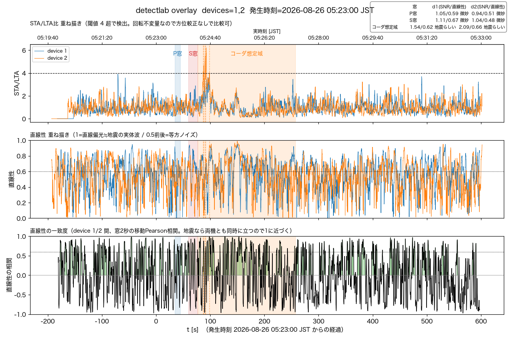
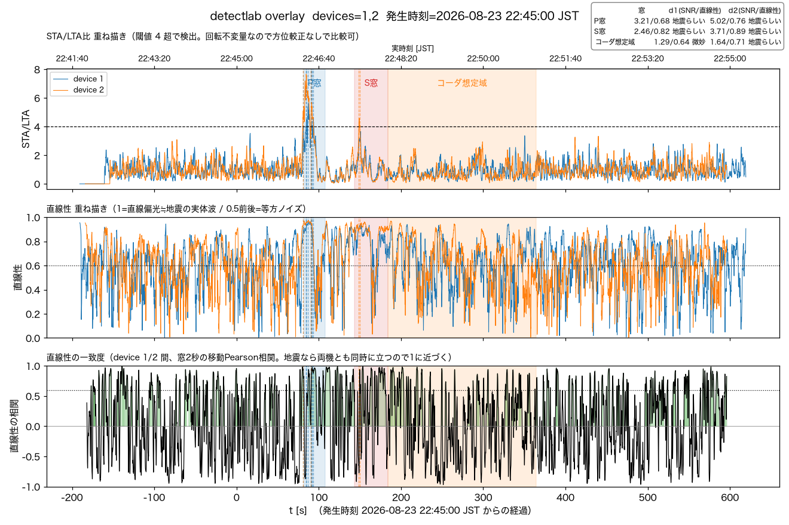

# 2026-08-28 窓別SNR/直線性の判定を画像にも文字で入れる

コーダ想定域窓を追加した後、「結果を画像に文字として入れられないか」という提案があり、
福島県沖M4.5のデータで2パターンをプロトタイプ化して比較した:

- **パターンA**: P窓・S窓・コーダ想定域の各帯の近くに両機の数値を注記
- **パターンB**: 図の隅にまとめて小さい表を1個貼る

パターンAはP窓・S窓が時間的に近く、注記ボックスが重なって文字が潰れた（3窓に増えた今、
帯ごと注記は構造的に破綻しやすい）。パターンBは窓が増えても表の行が増えるだけで済み、
明確に見やすかったため採用した。

## 実装

`tools/detectlab.py`:
- `classify_snr_wrect(snr, wrect) -> str`を切り出し、`report()`のテキスト出力と
  重ね描き表で判定ロジックを共有する。
- `report()`を、窓別の`(label, snr, wrect, verdict)`のリストを返すように変更
  （`--eew`未指定時は`None`）。
- `overlay_source()`内で`report()`の返り値を、main()スコープの`window_reports: dict[int, list]`
  （dev→結果）に集約する。`per_device`タプルの形（6要素）は変えていない——
  `pair_rolling_correlation()`が固定形で分解しているため、別引数として通す方が安全。
- `plot_overlay()`に`window_reports`引数を追加。2機重ね描き時、右上に窓×機体の
  SNR/直線性/判定の表を貼る。**凡例(device 1/2)は表と衝突するため左上へ移動**
  （`--eew`なし・表を出さない時は従来通り右上のまま）。

## 動作確認

福島県沖M4.5・浦河沖M6.0の2件を`--out`付きで再実行し、表と凡例が衝突せず両方読める
ことを確認。`--eew`なしのケースも表が出ず凡例が右上のままであることを確認（既存挙動の
回帰なし）。テスト1件追加（`classify_snr_wrect`の閾値）、`pytest tools/tests`は82件通過。

## 図

