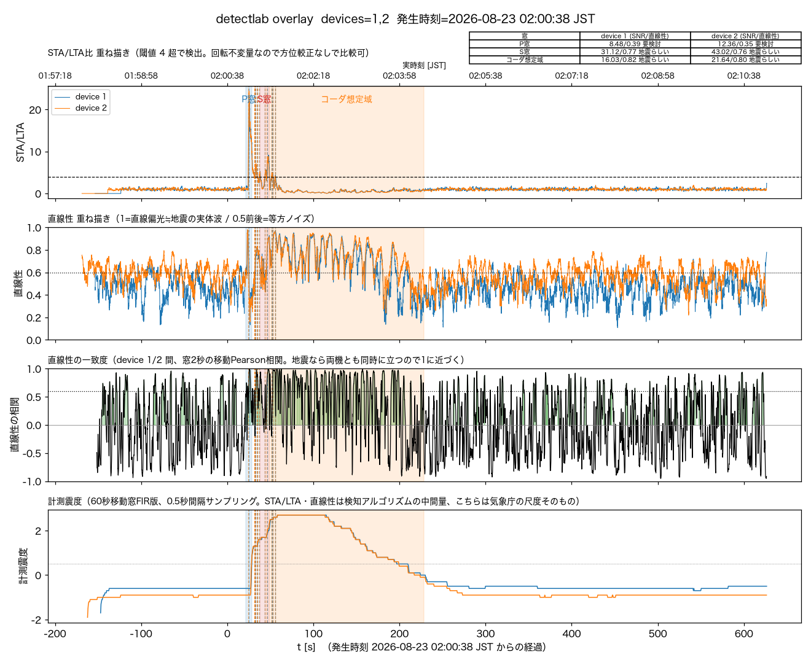
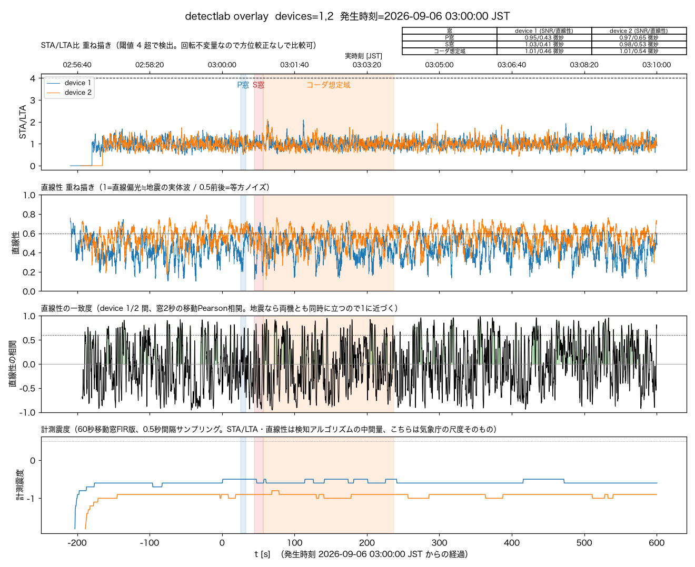

# 2026-09-08 detectlabに計測震度パネル(`--intensity`)を追加

## きっかけ

事後解析で「震度の時系列グラフ」（[この記事](https://qiita.com/compo031/items/298f946e5ca7a3e0e5b7)
のような、加速度を0.5秒毎に逐次フーリエ変換して計測震度の推移を追うグラフ）があると
便利だと前から思っていたが、実装を忘れていた。まず単発の`tools/intensity_timeline.py`
として試作し、2026-08-23茨城県南部M5.9（既に`cloud_confirmed`でI=2.7/2.6と確定済みの
イベント）で描いてみたところ立ち上がり・ピーク・減衰がきれいに出た。

その後「いつものdetectlabの図と時系列を合わせるとどう見えるか」を試したところ、
STA/LTA・直線性・直線性の一致度という検知アルゴリズムの中間量と、計測震度という
「結局どれくらい揺れたか」の最終結果を同じ時間軸で並べられることが分かり、事後解析の
標準ツールとして`detectlab.py`本体に組み込む方針にした。

## 実装

- `tools/jismo/realtime.py`に`intensity_timeline(gal, fs, step_seconds)`を追加。
  `RealtimeIntensity`（ファームと数値照合済みのFIR・60秒移動窓）へ1サンプルずつpushし、
  一定間隔で`current_intensity()`をサンプリングする薄い関数。単発試作の
  `tools/intensity_timeline.py`と`detectlab.py`の両方がこれを共有する（前者は
  複数`--event`を渡すだけの薄いCLIラッパーとして残した）。
- `detectlab.py`の重ね描きモード（`--device`複数 / `--event`複数）に`--intensity`
  フラグを追加。指定すると`plot_overlay()`が最下段に計測震度パネルを足す
  （`--intensity-step`でサンプリング間隔、既定0.5秒）。単体窓のプロット（`--device`1個）
  には配線していない——重ね描きで機体間の一致を見る文脈で使う機能のため。

## 実例: 検出できた地震 vs 完全埋没した地震

同じ`--intensity`付きの4段重ね描みで、対照的な2例を比較した。

**2026-08-23 茨城県南部M5.9**（震源距離155km、`cloud_confirmed`でI=2.7/2.6と自動確定済み）:

STA/LTA・直線性・直線性の一致度がP波到達（t≈25〜60s）で鋭く立つのに対し、計測震度は
60秒移動窓のぶん遅れてt≈100〜220s（S波〜コーダ）でなだらかに立ち上がりI=2.7でピークを
打ち、また緩やかに減衰する。「検知は一瞬、揺れの評価はもっと後まで続く」という時間差が
一枚で分かる。相関パネルが背景水準に戻るタイミングと計測震度の減衰がほぼ同じなのも確認できた。

**2026-09-06 茨城県沖M3.7**（震源距離199km、verdict=critical=完全埋没、`0001-59621040`/
`0002-59621040`として手動保存済み）:

4段とも到達窓の内外で分布が変わらない。STA/LTA・直線性・相関はP窓・S窓・コーダ想定域の
どこでも背景と同水準（SNR≈1.0前後）、計測震度も全区間ノイズ床(-0.6〜-1)に張り付いたまま
明確な山が一切無い。検出例と並べると「検出できた地震は4段とも同時に反応し、埋没した地震は
4段ともフラットなまま」という対比がそのまま可視化になっている。

## 次に可能になったこと

- `docs/post_hoc_detection.md`の標準コマンド例（全体像・低帯域・ズームの3箇所）に
  `--intensity`を追加し、重ね描き解析では基本的に付ける運用にした。
- `tools/README.md`のdetectlab節にオプション説明を追記した。
- 今後の事後解析ログで、STA/LTA・直線性だけでなく「結局震度いくつ相当の揺れだったか」を
  同じ図の中で確認できる。
