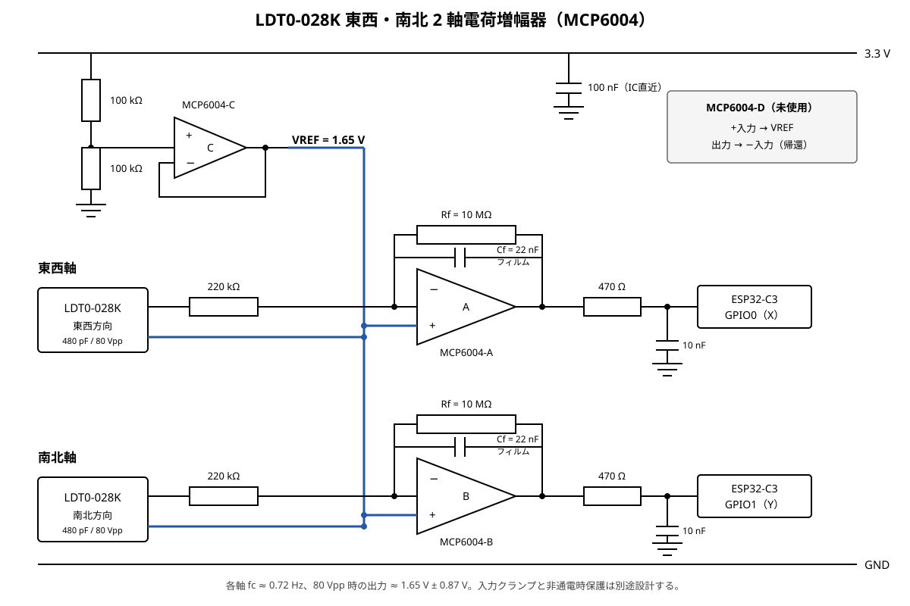

# LDT0-028K は 500 MΩ直結をやめ、電荷増幅器で受ける方針にする

LDT0-028K の低域を残すために検討していた `Rb=430〜500MΩ` の受動入力は、
計算上のカットオフ周波数は満たすものの、実装上は高インピーダンスすぎる。
基板表面の漏れ、湿気、フラックス残渣、配線容量、商用電源由来の電界、ESP32-C3
の SAR ADC 入力の充放電をすべて信号として拾いやすく、抵抗や配線自体がアンテナに
なる。抵抗値やシールドだけで粘らず、LDT0-028K を電荷増幅器で受けてから ADC へ
渡す方針に変更する。

## 初期定数

LDT0-028K の容量をデータシート値の `480pF`、実測最大出力を `80Vpp`
(おおむね `±40Vpeak`)とすると、ピーク電荷は次の通りになる。

```text
Qpeak = 480pF × 40V = 19.2nC
```

単電源オペアンプの非反転入力を `1.65V` にバイアスし、手持ちの `10MΩ` を
帰還抵抗に使う。帰還は `Cf=22nF` と `Rf=10MΩ` の並列を第一候補にする。

```text
fc = 1 / (2π × 10MΩ × 22nF) ≈ 0.72Hz
Vout_peak = Qpeak / Cf ≈ 0.87V
```

最大実測相当でも出力はおおむね `1.65V±0.87V` (`0.78〜2.52V`)に収まり、
3.3 V 系で余裕がある。`Cf=33nF` なら振幅余裕はさらに増えるが、`Rf=10MΩ` と
組み合わせると低域カットオフが約 0.48 Hz まで下がり、温度変化などの遅い変動を
余計に拾うため採用しない。
入力には `100〜220kΩ` 程度の直列抵抗、オペアンプ出力と ADC の間には
`100Ω〜1kΩ`、ADC 直前には `10〜100nF` を置く案とする。オペアンプの選定、
入力クランプの接続先、非通電時の入力許容は回路確定前に別途検討する。

東西・南北方向へ LDT0-028K を 1 個ずつ設置するため、オペアンプは `MCP6004` を
1 個購入する。内部 4 回路のうち A を東西軸、B を南北軸、C を共有の `1.65V`
基準バッファに使う。未使用の D は、非反転入力を `1.65V` 基準へ接続し、出力を
反転入力へ戻すボルテージフォロワとして終端する。東西軸は ESP32-C3 の `GPIO0`、
南北軸は `GPIO1` へ接続し、`10MΩ`・`22nF`・`220kΩ`・`470Ω`・`10nF` は
各軸に 1 組ずつ用意する。`100kΩ` 2 本による基準分圧と電源デカップリングは共有する。



## ブレッドボード電源装置の故障仮説

現行案の 1N60 は正側のクランプ電流を 3.3 V レールへ流すため、電源 OFF 時や
軽負荷時に逆給電してレールを持ち上げる経路は存在する。この経路は廃止し、少なくとも
ESP32 の 3.3 V レールをクランプ電流の捨て先として直接使わない。

ただし、`480pF`・`40Vpeak` に蓄えられるエネルギーは次の程度である。

```text
E = 1/2 × 480pF × 40² ≈ 0.38µJ
```

単発の LDT0-028K が持つこのエネルギーだけでブレッドボード電源装置を破壊した、
という説明は弱い。クランプ電流説を完全には棄却しないが、故障調査では逆給電に加えて、
クランプダイオードや電源の誤配線、電源の逆接、USB・オシロを介した別の GND／電源経路、
電源装置側の初期不良を優先して確認する。次回はピエゾを弾いた際と電源 OFF 時の
3.3 V レールをオシロで観測し、実際にレールが持ち上がるかを確認する。

## 何が覆ったか

- `430〜500MΩ` の受動入力で 0.8 Hz 付近まで読む案は撤回する。
- ADC 手前の大容量コンデンサによる容量分圧で信号を抑える案も、低域信号まで一律に
  捨てるため LDT0-028K には採用しない。
- LDT0-028K は電圧源ではなく電荷源として扱い、電荷増幅器の `Rf` と `Cf` で低域と
  最大振幅を決める。
- ブレッドボード電源装置の故障原因は未確定であり、「クランプ電流で壊れた」を結論には
  しない。
