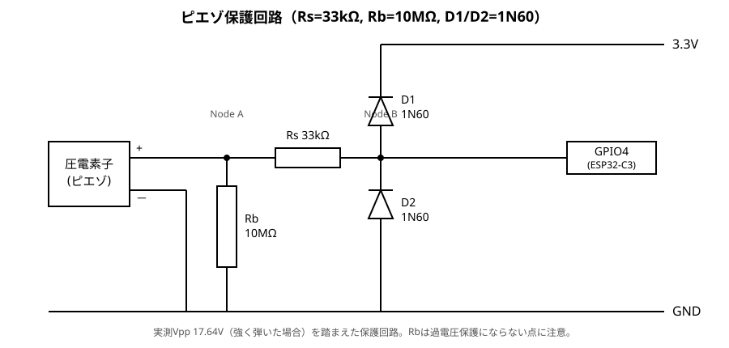

# ピエゾ加速度センサ実験機（着手・進行中）

[docs/other-sensors.md](other-sensors.md)で検討した「校正不要・検知限界の地震のタイミング
一致だけを裏取りできればラッキー」という補強検知構想の、実際に手を動かす版。
進捗は[docs/log/](log/)に都度追記し、このファイルは**現時点の結論・現状**だけを
反映する（経緯はログ側）。

## 1. 目的（再掲）

- gal単位の校正は狙わない。「同時刻にバーストが立ったか」の一致だけが価値。
- 既存device1/2は同じMEMS+同じアーキテクチャなので、共通のバグ・電気的ノイズを
  拾っても区別できない。原理の違うセンサで独立に裏取りできることに意味がある。
- 検知できなくても「地震ではなかった」の証明にはならない、あくまで補強・ラッキー枠。

## 2. 現状

- **センサ素子**: 部品箱からピエゾブザー素子（真鍮円板+セラミック層、リード線
  半田付け済み、直径20〜27mm程度）を発見、これを使う。AliExpressの完成品
  （電子聴診器用PVDFフィルムセンサ等）は帯域・価格ともに用途違いと判断済み
  （[other-sensors.md §3](other-sensors.md#3-候補センサの再評価)）。
- **マイコン**: 手持ちの4候補（ESP32-C3スーパーミニOLED付き開発ボード／
  Raspberry Pi Zero v1.3／micro:bitコピー品／Arduino Nano）から**ESP32-C3
  スーパーミニに決定**。理由は§3。
- **device_id**: 既存のテスト機(device_id=4294967295)は使わない方針
  （他の実験と混線させたくないため。新規に独立した機体として扱う）。
- **ADCピン**: 現物のシルク印字を確認しGPIO4に決定。接続前にオシロでピエゾ単体の
  出力電圧を確認したところ、指で強く弾いただけで17.64Vppという想定外の高電圧が
  出ており（その衝撃で素子自体も破損。在庫は複数あるので実害は無い）、保護回路を
  必須に格上げした（§4）。**GPIO4への実接続・書き込み・動作確認は完了**（§4）。
- **カンチレバー固定・おもり**: 割り箸で外周を挟んで固定し、裏面に小さな金属
  リングを接着。机を叩く間接的な振動にも反応することを確認した（§5）。

## 3. マイコン選定

| 候補 | WiFi | ADC | 判定 |
|---|---|---|---|
| **ESP32-C3スーパーミニ** | 内蔵 | 内蔵(GPIO0-4あたり、要現物確認) | **採用**。既存ファーム資産(ESP32系・PlatformIO)と地続きで、phase0(ローカルログ)からphase1(batch-uplink配送層に乗せる)まで買い替え不要 |
| Raspberry Pi Zero v1.3 | 非搭載(無印v1.3。Wが付くモデルのみ搭載) | 非搭載(アナログ入力ピン自体が無く外付けADC必須) | 見送り。遠回りが多い |
| micro:bitコピー品 | 非搭載(BLEのみ) | あり | 見送り。WiFiが無くBLE中継機がもう1台要る、クローン品質も不明 |
| Arduino Nano | 非搭載(古典ATmega328P想定) | あり | 見送り(ただし「反応するか」だけの最速確認にはUSBシリアルで一番手軽) |

OLEDモジュールが一部GPIOを使う（通常I2Cの2本）ため、実際に空いているADC対応
GPIOがどれかは現物到着後に確認する。

## 4. ピン選定と最小配線（phase0）

現物のシルク印字（写真で確認）から、このボードは定番の「ESP32-C3 SuperMini」
配置だと判明した：

- 一辺: `5V, GND, 3V3, RX, TX, GPIO2, GPIO1, GPIO0`
- もう一辺: `GPIO10, GPIO9, GPIO8, GPIO7, GPIO6, GPIO5, GPIO4, GPIO3`

ESP32-C3のADC1はGPIO0〜4の5chのみ（ADC2はWiFi使用時に競合するため非推奨）。
このうち**GPIO9はBOOTボタンに専有**され、**GPIO2は起動モード判定に使う
ストラップピン**なので両方避け、**GPIO4を採用**した（BOOTボタン側の配線から
物理的に離れていて配線が絡みにくいという以上の理由は無い）。

### 【教訓】ESP32へ繋ぐ前にオシロで確認したら、想定より遥かに高い電圧が出ていた

ESP32に接続する前に、[Electabuzz](https://github.com/nna774/Electabuzz)側のオシロ
（あまり信用できない個体とのことだが、桁を疑うレベルの値ではない）でピエゾ単体の
出力を確認した。指で強く弾いただけで**Vmax +11.76V・Vmin -5.88V・Vpp 17.64V**という、
ESP32のADC定格（3.3V、絶対最大でも+0.3V程度の余裕しか無い）を大きく超える電圧が
出ており、その衝撃で素子自体も破損した（在庫は複数あるので実害は無い）。**ESP32・
GPIO4はまだ何も接続していないため無事。**

ピエゾ素子は開放電圧が素子サイズに対して不釣り合いに高く出る（圧電ライターが
軽い一押しで火花を飛ばせる電圧を叩き出すのと同じ原理）——「軽く弾く程度なら
壊れる可能性は低い」という当初の想定は誤りだった。**保護回路は任意ではなく必須**。
接続前にオシロで実測しておいたおかげでマイコン側の被害を避けられた形になる。

追加確認: 「トン」と軽く叩く程度でも約1.5Vが出ることを確認した。単体では
ADCの安全範囲(0〜3.3V)には収まるが、それでも軽い入力でこの電圧域という時点で
油断できない——「操作を禁止すれば保護回路は不要」とはならない理由の裏付けにも
なる。

### 修正した最小配線（保護回路込み、次はこれで接続する）



信号はピエゾ(+)→Node A（ここでRbがGNDへ分岐）→Rs→Node B（ここでD1が3.3Vへ、
D2がGNDへ分岐）→GPIO4、という順で流れる。ピエゾ(-)はGNDに直結。

- **Rb(バイアス抵抗、10MΩ)**: ピエゾの2端子間(Node A—GND間)に直接。これが無いと
  Node Aが電気的に浮いてADCが安定しない。値の根拠は下記「抵抗値の設計根拠」参照。
  **過電圧保護にはならない**（DC基準点を作るだけ）。
- **Rs(直列抵抗、47kΩ)**: Node AとNode B(ADC直前)の間。クランプ時の電流を制限する。
  根拠は下記。
- **D1・D2(クランプダイオード)**: Node Bの電圧を3.3Vレール・GND付近にクランプする。
  **手持ちの1N60（ゲルマニウムダイオード）を使用**——順方向降下が小さく(~0.2〜0.3V)、
  Schottkyと同様の理由でクランプ後の電圧がESP32の絶対最大定格に収まりやすい。
  逆方向リーク電流はシリコン/Schottkyより大きいが、校正値を狙っていない今回の
  用途では実害無し。**これを省略しない。**
  （テスター(METEX P-10)のダイオードチェックモードで実測Vf≈0.24Vを確認。
  シリコン系(~0.5〜0.7V)との差はテスター精度の誤差より遥かに大きいため、
  型番の確証が無くてもゲルマニウム系である点は実測で裏付けられた。この値で
  再計算してもRs=47kΩのままで変わらない）

### 抵抗値の設計根拠

**Rb(バイアス抵抗、信号帯域を決める）**: ピエゾ本体の静電容量とRbがハイパス
フィルタを作る。データシート無しの汎用素子なので容量は概算値(20-27mm級の
ブザー素子でよくある**~20nF**程度、実測できるならテスターの静電容量レンジで
確認して計算し直すこと)を仮定する。1-10Hz帯を大きく削らないよう、カットオフを
0.8Hz程度に置くと:

```
Rb = 1 / (2π × f_c × C) = 1 / (2π × 0.8Hz × 20nF) ≈ 10MΩ
```

（誤り訂正: 当初「1MΩ前後」としていたが、計算すると`1/(2π×1MΩ×20nF)≈8Hz`と
狙いの1-10Hz帯のど真ん中にカットオフが来てしまう値だった。10MΩに変更する）

**Rs(直列抵抗、保護用の電流制限）**: 実測Vpp 17.64V(Vmax+11.76V)の実績を踏まえ、
次にもっと強く弾いた場合の余裕を見て最悪20Vを想定。クランプ後の電流を安全側で
0.5mA以下に抑える（ESP32-C3のピン許容注入電流の正確な値はデータシート未確認
のため、十分保守的な値として設定）:

```
Rs = (20V - 3.6V) / 0.5mA ≈ 33kΩ
```

**追記（再測定で更新）**: 別の機会に再測定したところVpp 20.74V
(Vmax+10.32V/Vmin-10.44V)を記録し、当初「最悪20V」とした仮定をわずかに
超えた。2回の実測で再現性があることが分かったため、想定を25Vに引き上げて
再計算し直した:

```
Rs = (25V - 3.6V) / 0.5mA ≈ 42.8kΩ → 標準値で47kΩ
```

**Rsは47kΩを採用する。** RbはRs(47kΩ)の200倍以上あるので、信号品質への影響は
無視できる。

（実装メモ: 手持ちに10MΩの単品が無いため、**1MΩ×10本の直列**でRbを構成する。
直列抵抗はそのまま足し算になるので値は変わらない。）

（3.6V = 3.3V + ダイオードの順方向降下~0.3V。手持ちの1N60(ゲルマニウム)は
順方向降下が小さく(~0.2〜0.3V)、シリコンの1N4148(~0.7V、クランプ後4.0V付近まで
上がりESP32の絶対最大定格(概ねVDD+0.3V≈3.6V)にほぼ余裕が無くなる)より適して
いる。低電流域(今回の設計電流0.5mA程度)ではVfはさらに下がる傾向があり、
実際のマージンはこれより広いと見てよい）

### 最小スケッチ（PlatformIO、動作確認用）

[docs/piezo_phase0/](piezo_phase0/)に、本線(`firmware/`)とは独立したスタンドアロン
PlatformIOプロジェクトとして置いた（実機での書き込み・動作確認済み、ESP32-C3向け
環境`esp32-c3-devkitm-1`）。

**注意: ESP32-C3 SuperMiniはUSB-シリアル変換チップを積んでおらず、ネイティブUSBを
`Serial`のCDCとして使うには`build_flags`で`ARDUINO_USB_MODE=1`と
`ARDUINO_USB_CDC_ON_BOOT=1`を明示する必要がある**（`platformio.ini`に設定済み）。
無いと書き込み自体は成功するのに`Serial.print`等がどこにも出ず、原因が分かりにくい。

生値を毎サンプル出すと流れて読めないため、**100msごとのmin/max/振れ幅(peak-to-peak)
だけ**を1行で出す:

```cpp
#include <Arduino.h>

const int kPiezoPin = 4; // GPIO4
const unsigned long kWindowMs = 100; // この時間内のmin/maxをまとめて出す

void setup() {
  Serial.begin(115200);
  analogSetAttenuation(ADC_11db); // フルスケール(~0-3.3V)を使う
}

void loop() {
  int vmin = 4095;
  int vmax = 0;
  unsigned long windowStart = millis();
  while (millis() - windowStart < kWindowMs) {
    int v = analogRead(kPiezoPin);
    if (v < vmin) vmin = v;
    if (v > vmax) vmax = v;
  }
  Serial.print(vmin);
  Serial.print(",");
  Serial.print(vmax);
  Serial.print(",");
  Serial.println(vmax - vmin); // peak-to-peak
}
```

```sh
cd docs/piezo_phase0
pio run --target upload --upload-port /dev/cu.usbmodemXXXX
pio device monitor -p /dev/cu.usbmodemXXXX
```

**【訂正の経緯】** 最初の測定はGPIO4を接続し忘れたフローティングピンの誤測定
だった（[docs/log/2026-08-11-piezo-gpio4-not-connected.md](piezo_phase0/log/2026-08-11-piezo-gpio4-not-connected.md)）。
GPIO4へ実接続してやり直した結果を以下に示す。

**実機での確認結果（GPIO4に実接続後）**: 無入力時のベースラインは
`min,max,pp`で**pp~110〜150程度**（フローティング時の220〜240より低く安定）。
指で突くと、突いた瞬間の窓でppが1000〜2000超まで跳ね上がり、その後2〜3窓
かけて減衰しながらベースラインへ戻る——**衝撃→機械的な振動の減衰**という
物理的に自然なパターンが見える。突く強さに応じて反応の大きさも変化しており
（弱い接触でpp~300程度、強めに突くとpp~1800〜2400）、単発のノイズではなく
実際の反応と判断した。強く突くとmin=0（D2のクランプ範囲）まで振れる場面も
あり、保護回路が設計通り機能していることも確認できた。

## 5. カンチレバー固定・おもりの実装と間接振動テスト

### 固定方法

割り箸2本で円板の外周（セラミックが無い金属フチ）を挟み、その状態で固定した
（[docs/log/2026-08-11-piezo-cantilever-and-mass.md](piezo_phase0/log/2026-08-11-piezo-cantilever-and-mass.md)参照）。

### おもり

固有周波数を計算で追い込むための情報（円板のバネ定数k）が無いため、
「軽く小さいものにして固有周波数を1-10Hz帯より上に離す」という安全側の方針
（§4の実測で感度に大きな余裕があると分かっているため、感度より安全マージンを
優先）で、小さな金属リングを**円板の裏面（セラミックが無い面）**に接着した。
セラミック面には触れていない。

### 間接振動テスト（机を叩く）

それまでの確認（円板を直接指で突く）は本番の使い方（架台経由の間接的な振動を
拾う）とは異なるため、**円板に触れず、割り箸や机を叩いて**反応するかを確認した。

結果、無入力時のベースラインpp~200〜260程度に対し、机を叩いた瞬間はpp~900〜2250
まで跳ね、min=0（クランプ）まで振れる場面も複数回観測した。叩いた直後は1〜2窓
かけて減衰しながらベースラインへ戻るパターンも、直接突いた時と同様に確認できた。
（元データは`docs/piezo_phase0/out.log`にteeしたもの。生ログは`.gitignore`対象
のためリポジトリには含めていない。）

**カンチレバー+おもりの機構が、間接的な振動でも機能することを確認できた。**

### 固有周波数の実測

保護回路手前（ピエゾ本体の2本のリード線間、Rs・ダイオードより前）をオシロで
直接観測し、机を叩いた直後のリンギング(減衰振動)の周期から固有周波数を見た。

- **10ms/div**: 複数周期(3〜4山)の減衰振動がはっきり見え、オシロの自動測定で
  **Freq: 49.947Hz**。信頼できる測定と判断。
- 2ms/divでも測定したが(95.057Hz表示)、この設定だと表示範囲が狭く繰り返しの
  山が確認できなかったため、この値は採用しない。

**約50Hzは1-10Hz帯から5〜10倍以上離れており、共振が測定帯域を歪めるリスクは
無いと判断した。**

## 6. 次にやること

- [x] ESP32-C3の実物ピン配置を確認し、使うADCピンを決める → GPIO4
- [x] ESP32へ繋ぐ前にオシロでピエゾ単体の出力電圧を確認する → 17.64Vpp、
      保護回路必須と判明（§4）。ESP32本体は未接続のため無事
- [x] 保護回路の抵抗値(Rs=47kΩ・Rb=10MΩ)を設計する → §4「抵抗値の設計根拠」
- [ ] ピエゾ本体の静電容量を実測し、Rbの前提(仮定20nF)を検算する
- [x] 保護回路込みの配線（§4）でGPIO4に接続し、phase0
      （足音・指弾き等に反応するかSerialで確認）を行う → GPIO4への実接続後に
      再検証し達成。突くとpp~1000〜2400まで跳ね2〜3窓かけて減衰する、
      強度に応じた反応を確認（§4）
- [x] カンチレバー固定方法（円板の縁を何に・どう固定するか）を決める →
      割り箸2本で外周の金属フチを挟んで固定（§5）
- [x] 自由端に載せる「おもり」を選定する → 情報不足のため「軽く小さいもの」の
      方針で小さな金属リングを裏面(非セラミック面)に接着（§5）
- [x] おもり装着後のリンギング周期をオシロで確認し、固有周波数が1-10Hz帯から
      離れているか確認する → 約50Hz(10ms/divで複数周期の減衰振動を確認、
      信頼できる測定)。1-10Hz帯から5〜10倍以上離れており問題無し（§5）

## 7. phase1（クラウド統合）

phase0達成を受け、[other-sensors.md §2](other-sensors.md#2-アーキテクチャ上の要点-配送と物理量前提ロジックを分けて考える)
で未定としていた設計を詰め（[docs/log/2026-08-12-piezo-phase1-plan.md](log/2026-08-12-piezo-phase1-plan.md)）、
Lambda側・firmware側とも実装し、**実機の書き込み・クラウド送信・dashboard表示
まで確認した**（[docs/log/2026-08-12-piezo-phase1-impl.md](log/2026-08-12-piezo-phase1-impl.md)）。
device_id=3を払い出し、クラウド側は`https://api.namazu.dark-kuins.net/devices/3`
で稼働中。

設計時点では「本線`firmware/`配下の`[env:]`として統合する」としていたが、
実装時にESP32-C3スーパーミニが**シングルコア**（本線`main.cpp`はデュアルコア
分離が前提、[docs/design.md](design.md)「ESP32ボードの差し替え」）と判明し、
`piezo_main.cpp`という別エントリポイントに測定・送信の2タスク構成を新規実装する
形に修正した。詳細は実装ログ参照。

- **物理量前提ロジックの迂回**: DynamoDBを都度引く必要は無い。detect Lambda
  (`lambda/detect/handler.py`)はバッチをパースした時点で`BatchMeta.sensor_type`を
  既に手元に持っているので、`_process()`冒頭にsensor_typeガードを1行足すだけで
  震度計算をスキップできる（既にingest Lambdaが毎バッチ`namazu-devices`に
  `sensor_type`を記録済みだが、detect側はDynamoDBを引く必要すら無い）。
  **ガード条件は`128〜249`の範囲であって「128以上」ではない**——`255`の`FAKE`は
  結合試験用にIIS3DHHCと同じ換算でgal相当の値を実際に送るセンサ
  (`firmware/lib/FakeSensor/FakeSensor.h`)で、震度計算パイプライン自体を
  試す用途なので従来通り計算に掛ける必要がある。
- **`device_prompt`自動生成**: ファーム側でアラートAPIを叩く実装をしなければ
  自然に発火しない。コード変更不要。
- **sensor_type番号**: `SENSOR_TYPE_PIEZO = 128`。`config.h`の`SensorType`enumが
  `kSensorAdxl355=1`・`kSensorLsm6dso=2`を予約済み（BMI160も候補）で`0〜127`は
  「加速度センサチップ」の列として埋まりかけているため、`128〜249`を
  「加速度ではない・非校正の生値センサ」の帯として新設する（`250〜254`は予約、
  `255`は既存の`FAKE`）。
- **ワイヤ形式(axes)**: `axes: 1`で正直に送る。`lambda/common/wire.py`の
  `parse()`を`axes`可変対応にし、dashboard向けのpadding（y,z列を0埋めして
  3列に揃える）は`lambda/api/handler.py`の`_waveform_payload()`1箇所に閉じる。
- **dashboardの非校正表示**（2026-08-12追記）: 波形表示自体は無改修で済んだが、
  ライブ画面のクライアント側概算震度（`JMA_FIR_TAPS`、gal前提）と縦軸の
  「gal」表示は、device3(ピエゾ)を選んでも素通しで嘘の値・単位を出していた
  （[docs/log/2026-08-12-dashboard-non-calibrated-display.md](log/2026-08-12-dashboard-non-calibrated-display.md)）。
  detect Lambdaと同じ`wire.is_calibrated()`を単一の真実として`/devices`
  APIに`calibrated`真偽値を足し、dashboardはそれを見て概算震度計算をスキップ・
  縦軸レンジ選択肢とヘルプ文言から「gal」を落とすようにした。
- **firmwareの配置**: `docs/piezo_phase0/`のまま育てず、本線`firmware/`配下の
  `[env:piezo]`として統合した。ただし本線`main.cpp`をそのまま拡張したのではなく、
  ESP32-C3がシングルコアなため別エントリポイント`piezo_main.cpp`を新設した
  （下記「実装状況」参照）。`tools/provision_device.py`のNVSプロビジョニング
  配線はそのまま再利用できた。

### 実装状況

- [x] `wire.py`にsensor_type追加・axes可変化
- [x] detect Lambdaにガード追加（`128〜249`の範囲のみ、`255`は除く）
- [x] api Lambdaにpadding追加
- [x] `provision_device.py`にpiezo用env追加
- [x] `firmware/`にpiezo用envとセンサ読み取りコードを追加
      （`piezo_main.cpp`・`RawSensor`/`PiezoSensor`・`NamzWire`のN軸対応）
- [x] device_id払い出し・サーバapply・焼く → device_id=3、terraform apply済み、
      `pio run -e piezo-provision`→`pio run -e piezo -t upload`で実機書き込み済み
- [x] 実機送信確認・S3格納/dashboard波形表示の確認・RAM実測 → 起動時空きヒープ
      162KB・maxblock 143KBと健全。`/devices/3`でonline確認、dashboardで波形
      表示も確認（詳細は実装ログ参照）

### 運用開始後の観測

- **値はgalではなく12bit ADC生値(0〜4095)**。APIの`x`フィールドはワイヤ形式
  互換のためgal相当の枠に間借りしているだけで、校正はしていない（本章冒頭）。
  4095または0に張り付いても、§4の保護回路(Rs=47kΩ＋D1/D2クランプ)が
  設計通り機能しているだけで破損の兆候ではない（§5でmin=0クランプの実績あり）。
- **風で本体が直接励振されている可能性が高い**：稼働直後、ライブ画面で振幅の
  大きい山が繰り返し出る事象を発見。生波形をFFTすると0.03〜0.1Hz(風の息の周期)
  のエンベロープに約50Hz(§5実測のカンチレバー固有振動数と一致)のリンギングが
  乗る形で、机を叩いた時と同じ「衝撃→減衰」シグネチャが繰り返し出ていた。
  窓・玄関・架台(コンクリートブロック)は目視で揺れていないとの現場確認から、
  むき出しのカンチレバー構造自体が風で直接励振されていると判断（詳細:
  [docs/log/2026-08-12-piezo-wind-sensitivity-observation.md](log/2026-08-12-piezo-wind-sensitivity-observation.md)）。
  風除け筐体の要否・設計はまだ未着手。

## 8. 3軸化(X/Y/Z)に向けた準備（検討中・ピン予約のみ実施、実装は未着手）

LDT0-028K([§7末尾](log/2026-08-12-piezo-phase1-impl.md#ldt0-028kte-connectivity製pvdfフィルム振動センサを導入する時の注意)で
導入時の注意点、[抵抗設計](log/2026-08-12-piezo-phase1-impl.md#ldt0-028k導入時の抵抗設計データシート実測値ベース購入前の見積もり)を
検討済み)を2個購入したことを受け、既存Z軸(圧電ブザー、GPIO4)に加えて
X/Y水平2軸を足す3軸化を検討した。経緯・判断理由は
[docs/log/2026-08-12-piezo-phase1-impl.md「3軸化に向けた準備」](log/2026-08-12-piezo-phase1-impl.md#3軸化xyzに向けた準備ピンアサイン固定方針device_idram見積もり)参照。

- **ピンアサイン（予約）**: ADC1(GPIO0〜4)のうちGPIO4=Z(既存)・GPIO2=ストラップピン
  除外済み。**X=GPIO0、Y=GPIO1**を予約する。GPIO3は予備として空けておく。
- **固定方針**: Zは既存(ブロックに直接固定済み)のまま。X/Yは
  LDT0-028Kのcrimped contactsをユニバーサル基板へ直接ハンダ付け
  （データシート推奨の取り付け方法、割り箸カンチレバーの自作は不要）し、
  その基板をブロックに固定する。X用・Y用は膜面が互いに直交するよう配置する
  こと（LDTシリーズは膜面に垂直な方向が最感度軸のため）。
- **device_id**: 新規に割らず**既存device_id=3を再利用する**。同一筐体・
  同一ESP32-C3に軸を足すだけで、`axes`は`NamzWire`が既にN軸対応済みの
  ワイヤ形式属性であり、device_id/sensor_typeとは独立。device1/2も
  元々「1台=複数軸」の設計なのでこれに合わせる。
- **RAM見積もり**: 現状(1軸・30秒バッチ)は`kBatchSamples=3000`×2B=6000Bで、
  実機起動時`free heap 162KB / maxblock 143KB`を確認済み。3軸化で
  1サンプルあたり2B→6Bになるため、バッチは概算18KB程度（3倍）。
  `kMaxRamBatches=1`のままでも143KBの連続空きに対して十分収まる見込み
  だが、実装後は起動時ヒープログで実測確認すること。
